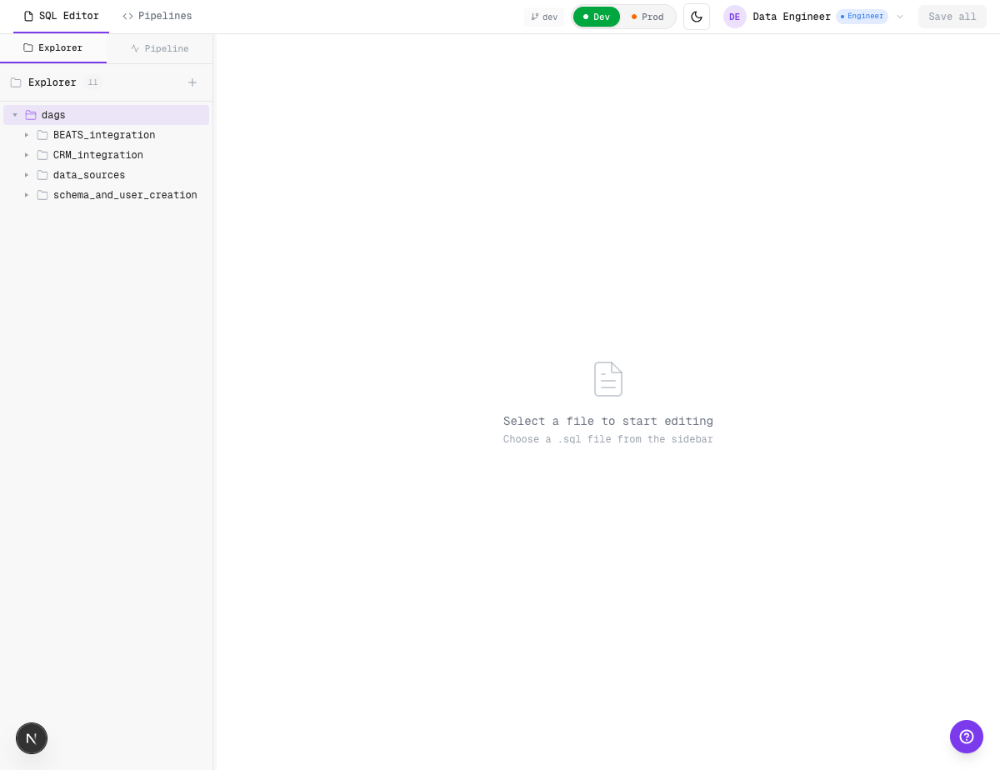
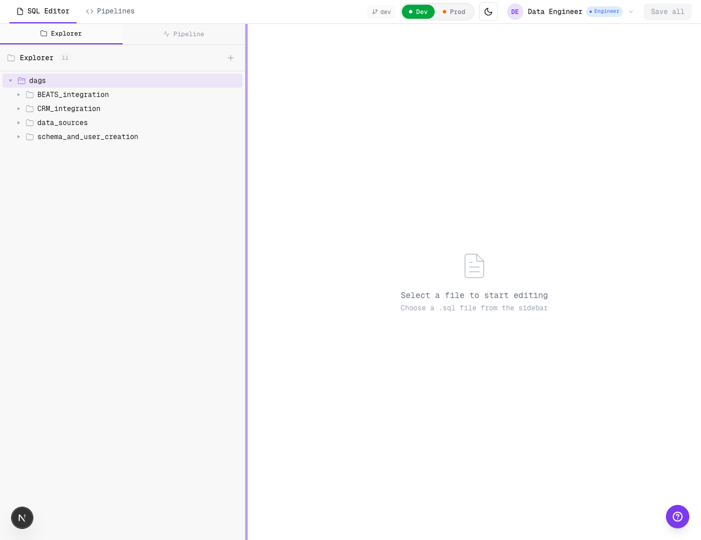
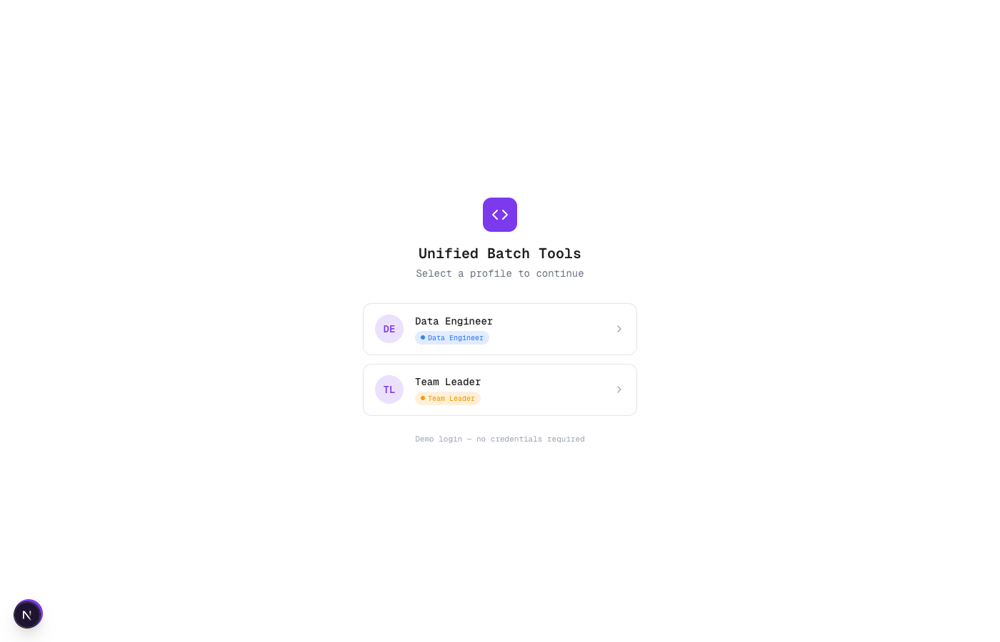
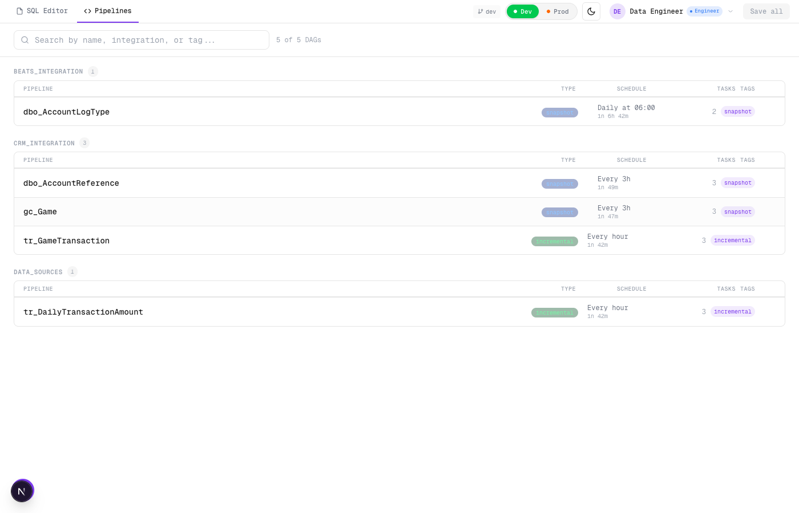
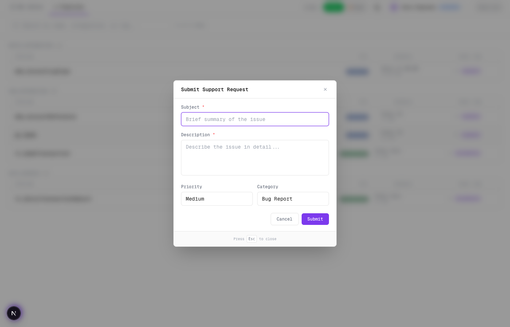
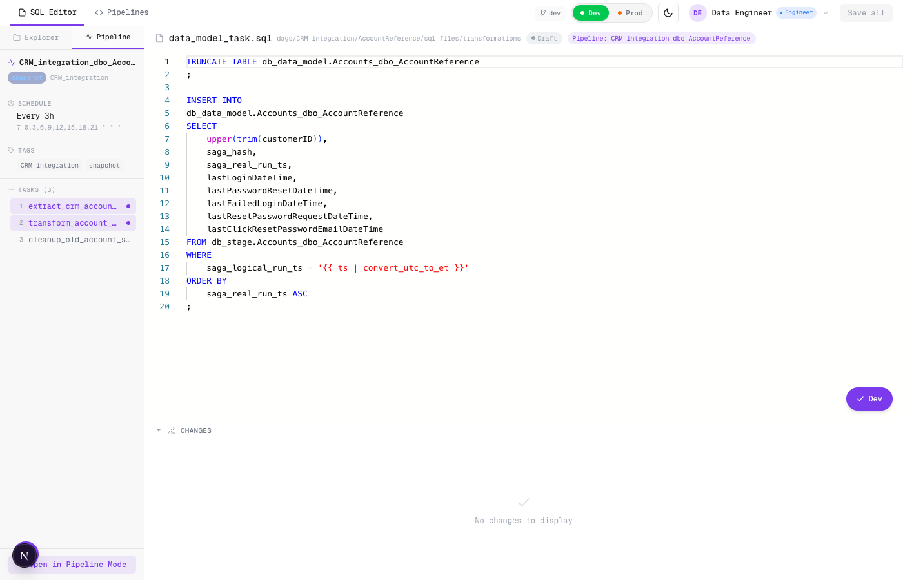
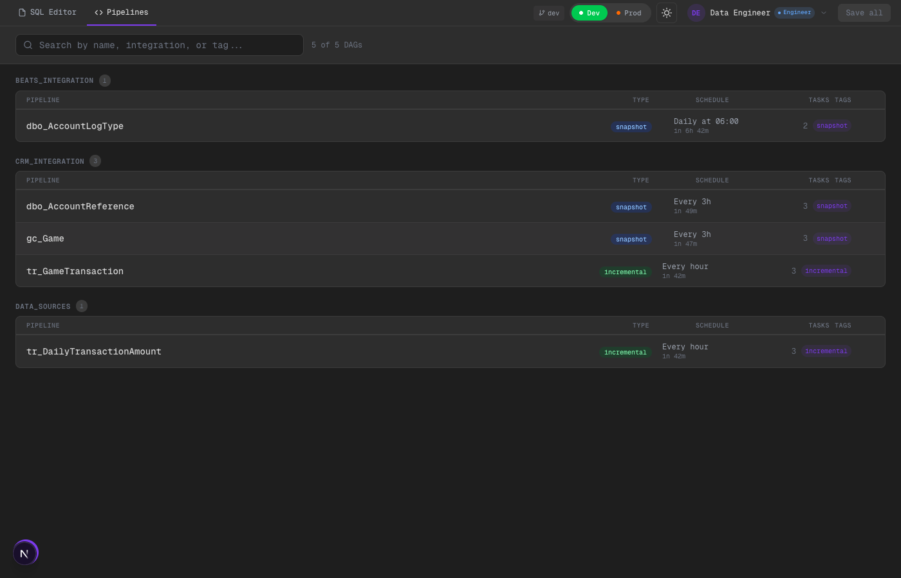

# Changelog

Registro visual de cambios implementados en Unified Batch Tools.

---

## [Fase 11-Feb / Phase 1] Navigation foundation (folder selection + resizable sidebar + global search consistency)

Se implementaron los ajustes base de UX para navegación y layout del editor:

### Como se ve

### Como funciona
- El file tree ahora permite **seleccionar carpetas** (además de expandir/colapsar), con estado visual persistido en store.
- Se agregó **split resizable** entre sidebar y editor en Code Mode:
  - drag handle vertical,
  - límites de ancho mínimos/máximos,
  - ancho persistido en Zustand (`sidebarWidth`).
- Se mejoró legibilidad para nombres largos en el tree (`truncate` + `title` + `min-w-0`).
- `QuickOpen` ahora:
  - filtra rutas DDL para respetar la policy de invisibilidad DDL,
  - al seleccionar resultado, fuerza modo `code` para evitar pérdida de contexto al buscar desde `pipeline`.

### Scaffold / TODOs
- Mocking adicional: no aplica en esta fase (solo UX/state).
- TODO explícito para fase siguiente: reutilizar `selectedFolder` para abrir DAG config al seleccionar root folder en `Pipelines Pro`.

---

## [Fase 1A] Login dummy con roles

Pantalla de login con dos usuarios hardcodeados: **Data Engineer** (role: user, puede hacer submit) y **Team Leader** (role: leader, puede aprobar merges a prod). Sin credenciales reales — click para entrar.

### Como se ve

### Como funciona
- Zustand store (`auth-store.ts`) con persist a localStorage
- AuthGuard en `layout.tsx` muestra LoginScreen si no hay usuario
- UserMenu en el header con avatar, nombre, badge de rol, dropdown para switch user y logout
- El rol se usa mas adelante para controlar aprobaciones de produccion

---

## [Fase 1B] DDL invisible + agrupacion por tag

Los archivos DDL (CREATE TABLE) ya no aparecen en ningun lado de la UI. El pipeline overview ahora agrupa por **tag** en vez de por integrationName.

### Como se ve

### Como funciona
- `task-type-utils.ts` detecta DDL por path (`/ddl/` en la ruta)
- `isDdlPath()` filtra archivos DDL del file tree en Code Mode
- `getNonDdlTasksForPipeline()` excluye DDL tasks del conteo y listado en Pipeline Mode
- Pipeline overview agrupa por `tags[0]` (BEATS_INTEGRATION, CRM_INTEGRATION, DATA_SOURCES)
- Task count en el overview muestra solo tasks no-DDL (ej: 3 en vez de 5)

---

## [Fase 1C] Boton de soporte

Boton flotante de soporte que simula crear un ticket de Jira y notificar a Mattermost.

### Como se ve

### Como funciona
- Boton `?` fijo en bottom-left (SupportButton.tsx)
- Modal con subject, description, priority (Low/Medium/High/Critical), category
- Al submit genera ticket fake (DATA-XXXX) y muestra toast de confirmacion
- En dev, el boton puede quedar detras del toolbar de Next.js (solo en desarrollo)

---

## [Fase 1D] Parametros completos del DAG

Todos los campos del `configfile_proposal.yml` son editables desde el panel de configuracion del pipeline.

### Como se ve

### Como funciona
- **Basic Info**: owner, start date (date picker), timezone (dropdown)
- **Schedule**: cron expression con validacion (5/5 campos) y descripcion legible ("Every 3h")
- **Tags**: chips removibles con autocomplete para agregar
- **Channels**: team, incidents channel, alerts channel
- **Task Config**: expandible por task con workload, connections (source/target), query file, timezone
- Para tasks DQA: alert kind, tolerance, query type
- Para tasks Load: target type (DB/S3/Email) con campos de email condicionales
- Tipos extendidos en `types.ts`: TaskConfig, DqaConfig, LoadTarget, TaskConnection

---

## [Fase 2] Layout unificado con dos modos

Una sola pagina con tabs **SQL Editor** (Code Mode) y **Pipelines** (Pipeline Mode). Sin page reload al switchear — todo en la misma shell con `viewMode` en un store compartido.

### Como se ve

### Como funciona
- `workspace-store.ts` maneja `viewMode: "code" | "pipeline"` con persist
- `WorkspaceShell.tsx` renderiza `CodeView` o `PipelineView` segun el modo
- `UnifiedHeader.tsx` con tabs, env toggle (Dev/Prod), theme toggle, user menu, save all
- Rutas `/editor` y `/pipelines` siguen funcionando como aliases que setean el viewMode
- La ruta raiz `/` renderiza WorkspaceShell directamente

---

## [Fase 3] Integracion cross-view

### 3A. Click en task abre SQL editor (slide-out)

Desde Pipeline Mode, click en cualquier task card abre un slide-out con Monaco editor para editar el SQL sin salir del contexto del pipeline.

- Panel deslizable desde la derecha (~50% width)
- Header con nombre de archivo, breadcrumb, status badge
- Boton "Open in Code Mode" para saltar al editor completo
- Save button con estado "All changes saved"
- Se cierra con X o Escape

### 3B. Pipeline sidebar en Code Mode

Desde Code Mode, el sidebar tiene dos tabs: **Explorer** (file tree) y **Pipeline** (config del pipeline al que pertenece el archivo actual).

- Muestra nombre del pipeline, schedule, cron, tags, lista de tasks
- Task actual resaltada en la lista
- Link "Open in Pipeline Mode" para saltar al detalle completo
- Si el archivo no pertenece a ningun pipeline, muestra "No pipeline context"
- `PipelineContextIndicator` en el tab bar del editor muestra "Pipeline: X"

---

## [UI General] Dark mode

Tema oscuro completo con toggle en el header.

- Todos los componentes soportan dark mode via CSS variables
- Badges de stage (EXTRACT, TRANSFORM, DQA) legibles en ambos temas
- Toggle persiste en localStorage

---

## [Fase 4] Git integration

Integracion con git real via `simple-git`. Los botones Save, Submit to Dev y Submit to Prod ahora ejecutan operaciones git reales en un repo externo, ademas de actualizar el estado local.

### Como se ve

### Como funciona

**Backend (Next.js API routes):**
- `GET /api/git/status` — branch actual, archivos modificados, log
- `POST /api/git/save` — escribe archivo al disco en el repo externo
- `POST /api/git/submit-dev` — git add + commit + merge a dev
- `POST /api/git/submit-prod` — git add + commit, crea merge request (sin merge automatico)
- `POST /api/git/approve-prod` — merge efectivo a main (prod)
- `POST /api/git/init` — crea feature branch desde dev

**Test repo:**
- Script `scripts/setup-test-repo.sh` crea repo en `/tmp/test-pipeline-repo`
- Branches: `main` (prod) y `dev`, poblado con los SQL files del mock data
- 17 archivos SQL reales organizados en la misma estructura de carpetas

**Integracion UI:**
- `BranchIndicator` en el header muestra branch actual (polling cada 10s)
- Save: actualiza Zustand state + `POST /api/git/save` (fire-and-forget)
- Submit Dev: actualiza status + `POST /api/git/submit-dev`
- Submit Prod: actualiza status + `POST /api/git/submit-prod`
- Approve: actualiza status + `POST /api/git/approve-prod`
- Graceful degradation: si el repo no esta disponible, la UI sigue funcionando

**TODOs en el codigo:**
- `// TODO: Replace direct merge with PR creation via Bitbucket API` en cada merge operation

---

## [Fase 5] Polish dual interface

Paridad de features entre Code Mode y Pipeline Mode. Ambos modos permiten las mismas operaciones con diferente interfaz.

### Nuevas features

**Diff en slide-out (Pipeline Mode):**

- Boton "Diff" en el footer del slide-out SQL editor
- Toggle entre editor normal y diff side-by-side
- Compara contenido actual vs ultimo guardado

**Add Task (Pipeline Mode):**

- Boton "+ Add task" en la seccion TASK ORDER del pipeline detail
- Input inline para nombre del archivo (Enter para crear, Esc para cancelar)
- Crea archivo SQL en la carpeta `transformations/` del pipeline actual
- Abre automaticamente el slide-out editor con el archivo nuevo

### Paridad de features

| Accion | Code Mode | Pipeline Mode |
|--------|-----------|---------------|
| Editar SQL | Editor principal | Click task -> slide-out |
| Config pipeline | Sidebar tab "Pipeline" | Inline en detail |
| Reordenar tasks | _(no aplica)_ | Drag-and-drop |
| Cron/Tags | Sidebar pipeline tab | Config section |
| Git operations | Header buttons | Header buttons |
| File tree | Sidebar Explorer | _(nav por pipeline)_ |
| Crear SQL | Sidebar + button | "+ Add task" button |
| Ver diff | Diff panel bajo editor | Boton Diff en slide-out |
| Branch indicator | Header | Header |

---

## [Fase 6] Approval Dashboard para Team Leader

Vista dedicada "Reviews" visible solo para el rol **Team Leader** que muestra todas las submissions pendientes como un batch, con diffs expandibles y approve/reject del lote completo.

### Como se ve

### Como funciona

**Nuevo view mode:**
- `ViewMode` extendido con `"approvals"` en `workspace-store.ts`
- Tab "Reviews" en el header aparece solo cuando `currentUser.role === "leader"`
- Badge con count de archivos pendientes en el tab

**Batch actions:**
- `approveAll()` y `rejectAll()` en el editor store operan sobre TODOS los archivos con `status === "pending_approval"`
- Una sola llamada a `/api/git/approve-prod` (es un merge de branch, no por archivo)

**Vista de aprobaciones (`ApprovalsView.tsx`):**
- Lista archivos pendientes agrupados como un solo "submission batch"
- Click en un archivo expande su diff inline (Monaco DiffEditor)
- Muestra fecha relativa de submission (ej: "3h ago")
- Botones "Approve All" y "Request Changes" al pie del batch card
- Confirmacion visual despues de aprobar/rechazar
- Empty state cuando no hay pendientes

**Terminologia abstracta (sin conceptos git):**

| Concepto git | Concepto UI |
|-------------|-------------|
| PR / merge request | Submission |
| Merge to main | Approve |
| Close PR | Request Changes |
| Diff | View changes |

---

## [Fase 6B] Pipeline detail — layout de dos columnas

El detalle del pipeline ahora usa un layout side-by-side: **tasks a la izquierda**, **configuracion a la derecha** con tabs.

### Como se ve

### Como funciona
- Layout `flex` horizontal: task list (flex-1) + config panel (380px fijo)
- Config panel usa 4 tabs: **Basic Info**, **Schedule**, **Tags**, **Channels**
- Cada tab muestra solo su seccion — no hace falta scrollear toda la config
- Task list ocupa todo el alto disponible con scroll independiente
- Boton de soporte movido a bottom-right para no pisarse con el toolbar de Next.js
