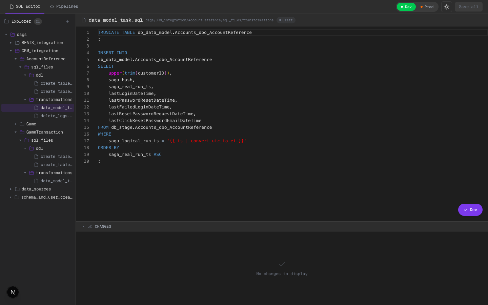
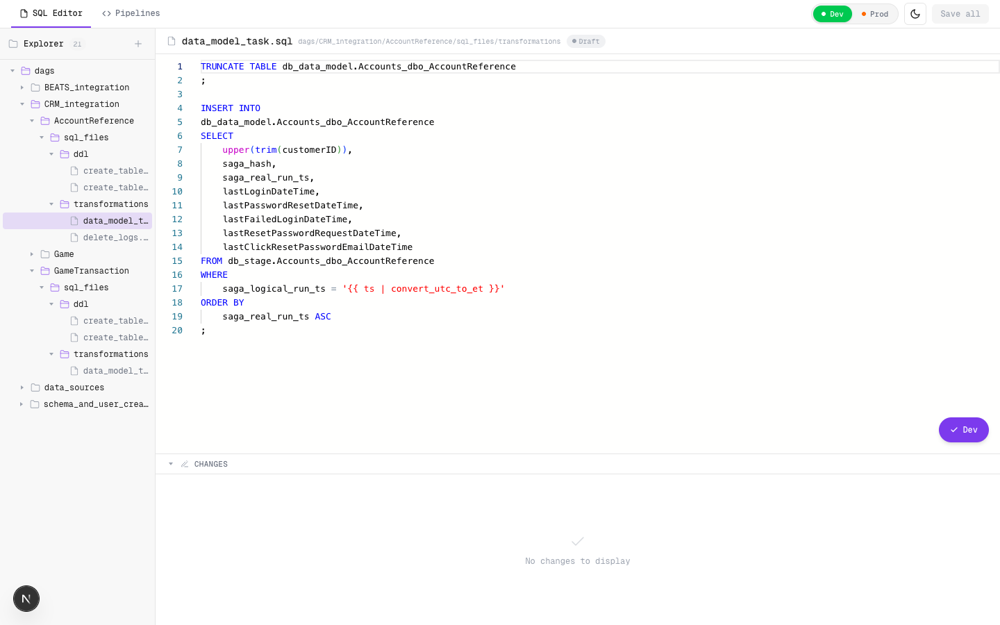
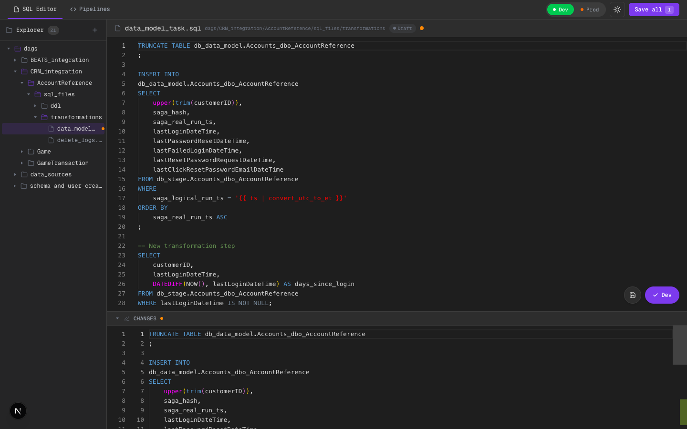
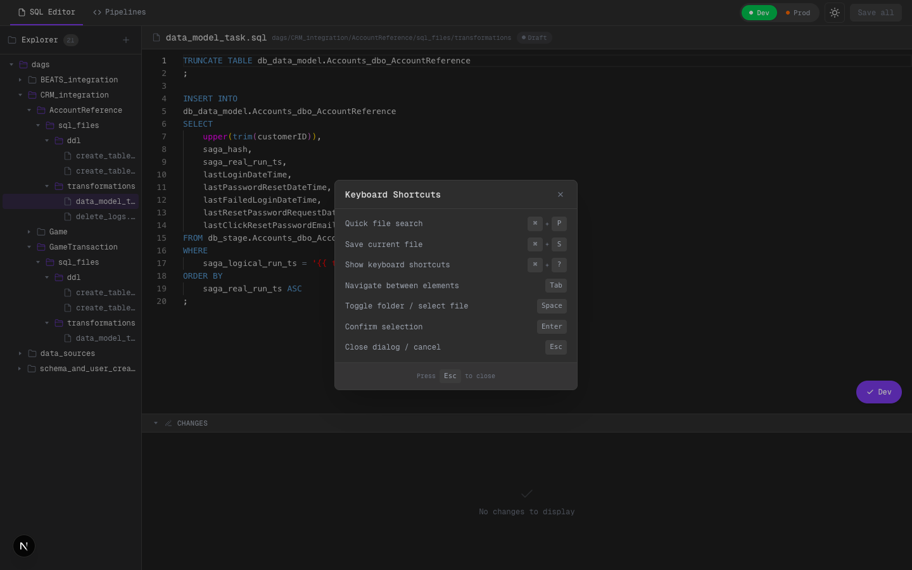

# SQL Pipeline Editor - UI Scaffold

Next.js mock interface that replicates the core workflows of an Airflow-based SQL pipeline system: file browsing, SQL editing, diff review, submit/approval flows, and pipeline task ordering.

**Stack:** Next.js 16 + TypeScript + Monaco Editor + Zustand + Tailwind CSS v4
**Data:** All mock, persisted in localStorage. No backend required.

---

## SQL Editor

Full SQL editing environment with file tree, Monaco editor, and diff viewer.

**Dark mode** — file tree expanded, SQL syntax highlighting, status badges, environment toggle (Dev/Prod):



**Light mode** — same layout, full theme support including Monaco editor theme swap:



### Key features
- Repo browser sidebar with 21 SQL files organized by integration/table
- File count badge, modified indicators (orange dot), status badges (Draft/Submitted/Pending/Approved)
- Create new `.sql` files via `+` button
- Monaco Editor with full SQL syntax highlighting
- ARIA tree roles and keyboard navigation (Tab, Space/Enter)

---

## Diff Panel

Side-by-side diff comparing current buffer vs last saved version. Collapsible via the CHANGES header chevron.



The diff panel shows inline additions (green) and the original content, just like a git diff. The orange dot on the file name and the "Save all (1)" button in the top bar indicate unsaved changes.

---

## Submit & Approval Flow

Environment toggle (Dev/Prod) controls the submit behavior:
- **Dev submit:** status changes to Submitted
- **Prod submit:** status changes to Pending Approval, showing the approval panel


The approval panel shows submission timestamp and Approve/Reject buttons. Toast notifications confirm each action. Note the "Pending" badge in both the file tab and the tree node.

---

## Quick File Search (Cmd+P)

VS Code-style modal with fuzzy filtering across all 21 SQL files. Arrow keys to navigate, Enter to open, Esc to close.


---

## Keyboard Shortcuts (Cmd+?)

Overlay listing all available shortcuts. Global Cmd+S saves the current file from any view with toast feedback.



---

## Pipeline Overview

All DAG configurations grouped by **tag** (BEATS_INTEGRATION, CRM_INTEGRATION, DATA_SOURCES), with search/filter, type badges, cron schedule descriptions, and next-run countdowns. DDL tasks are excluded from counts and listings.


---

## Pipeline Detail

Per-pipeline view with extended configuration editor, drag-and-drop task ordering, and SQL slide-out editor.


### Configuration
- **Basic Info:** owner, start date, timezone
- **Cron input:** live validation indicator, 5/5 part counter, preset buttons (Hourly, Every 3h, Daily 6am, Every 15m)
- **Tag editor:** autocomplete from existing tags, chip display with remove, keyboard navigation
- **Channels:** team, incidents channel, alerts channel
- **Next-run countdown** in accent color (e.g., "Next in 1h 14m")

### Task Ordering
- Drag-and-drop reorderable task list (DDL excluded)
- Task cards with order badge, stage badge (EXTRACT/TRANSFORM/DQA), SQL filename
- Per-task config panel: workload, connections, query file, DQA settings
- Color-coded left borders per stage type
- Connector arrows between tasks
- "+ Add task" button to create new SQL files from Pipeline Mode

### SQL Slide-out Editor
- Click any task to open Monaco editor in a slide-out panel
- Edit SQL without leaving pipeline context
- Diff toggle button in footer
- "Open in Code Mode" button
- Save with Cmd+S


---

## Bonus Features

| Feature | Access | Description |
|---------|--------|-------------|
| Quick File Search | `Cmd+P` | Fuzzy-filter and jump to any SQL file |
| Keyboard Shortcuts | `Cmd+?` | Overlay listing all shortcuts |
| Global Save | `Cmd+S` | Saves current file with toast feedback |
| Toast Notifications | Automatic | Slide-in toasts (3s auto-dismiss) on save/submit/approve/reject |
| Next-Run Countdown | Pipelines | Cron parser shows relative time until next execution |
| Collapsible Diff | Click header | Toggle CHANGES panel visibility |
| Dark / Light Mode | Top bar icon | Full theme support including Monaco Editor |
| Keyboard Accessibility | Tab navigation | Focus-visible rings, ARIA roles on all interactive elements |
| Login Screen | App start | Two user profiles (Data Engineer / Team Leader) with role badges |
| Pipeline Sidebar | Code Mode | Pipeline context (schedule, tags, tasks) for current file |
| Git Integration | Backend | Save/Submit/Approve write to real git repo via API routes |
| Branch Indicator | Header | Shows current git branch with polling |
| Support Modal | Floating `?` | Simulates Jira ticket creation + Mattermost notification |

---

## Architecture

```
ui/src/
├── app/
│   ├── layout.tsx              # Root + AuthGuard + SupportButton
│   ├── page.tsx                # WorkspaceShell (unified entry)
│   ├── editor/page.tsx         # Code Mode alias
│   ├── pipelines/page.tsx      # Pipeline Mode alias
│   └── api/git/                # Git API routes (status, save, submit, approve)
├── lib/
│   ├── store.ts                # Editor store (Zustand + persist + git API calls)
│   ├── pipeline-store.ts       # Pipeline store (Zustand + persist)
│   ├── workspace-store.ts      # View mode store (code/pipeline)
│   ├── auth-store.ts           # Auth store (login/logout)
│   ├── git-service.ts          # Server-side git operations (simple-git)
│   ├── task-type-utils.ts      # Stage derivation + DDL detection
│   ├── types.ts                # Shared types (extended with TaskConfig, DqaConfig, etc.)
│   ├── mock-data.ts            # SQL files + DAG configs
│   ├── pipeline-mock-data.ts   # Tasks across 5 DAGs (DDL filtered)
│   ├── cron-utils.ts           # Cron parser + next-run calculator
│   └── file-utils.ts           # Flat paths -> tree builder
├── components/
│   ├── WorkspaceShell / UnifiedHeader / CodeView / PipelineView
│   ├── LoginScreen / AuthGuard / UserMenu
│   ├── Sidebar (Explorer + Pipeline tabs) / FileTree / FileTreeNode
│   ├── EditorPanel / SqlEditor / SqlDiffViewer
│   ├── PipelineContextIndicator / PipelineSidebarPanel
│   ├── SupportButton / SupportModal
│   ├── git/BranchIndicator
│   └── pipeline/
│       ├── PipelineBoard / PipelineOverview / PipelineDetail
│       ├── PipelineTaskCard / SqlEditorSlideOut
│       ├── DagConfigEditor / TaskConfigPanel
│       └── CronInput / TagEditor
scripts/
└── setup-test-repo.sh          # Creates test git repo at /tmp/test-pipeline-repo
```

## Running

```bash
cd ui && npm install && npm run dev
# http://localhost:3000
```
