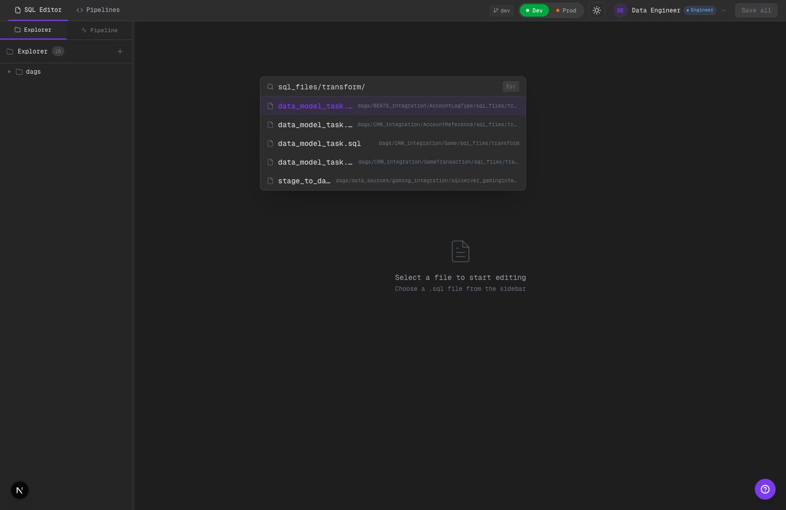
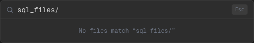

# 2026-02-11 — Phase 2 Stage Folder Alignment

Alcance implementado:
- Migración de paths mock a convención stage-first (`extract/transform/load/dqa`).
- Alineación de `pipeline-mock-data` con paths nuevos.
- Actualización de fixture repo script con estructura stage-first.
- Ajuste de helper de stage detection para nueva convención.

## Qué cambió

### Migración de paths en mock data
- Se eliminó el contenedor `sql_files` del path visible de trabajo.
- Se reemplazaron referencias legacy (`transformations`, `dml`) por folders de etapa directos:
  - `.../extract/...`
  - `.../transform/...`
  - `.../load/...`
  - `.../dqa/...`
  - `.../ddl/...`
- Se migró `schema_and_user_creation/schema_creation/schemas.sql` a `schema_and_user_creation/load/schemas.sql`.
- Se agregaron entradas faltantes de SQL mock para etapas `extract` y `dqa` en pipelines que solo tenían `transform`.
- Se agregaron ejemplos `ddl/bi_custom_ddl.sql` para representar DDL editable por BI.

### Alineación de pipeline tasks
- `ui/src/lib/pipeline-mock-data.ts` ahora apunta a paths stage-first para tasks de negocio.
- Se mantuvo el filtrado DDL en los entrypoints principales sin cambios de política.

### Detección de etapa por path
- `getStageFromPath` ahora reconoce explícitamente:
  - `/extract/` -> `extract`
  - `/transform/` -> `transform`
  - `/load/` -> `load`
  - `/dqa/` -> `dqa`
- Se mantiene compatibilidad backward para paths legacy (`/transformations/`, `/dml/`) como fallback de migración.

### Política DDL visible
- Se mantiene la carpeta `ddl` visible para SQL users.
- Se ocultan solo los DDL transparentes del scaffold:
  - `create_table_stage.sql`
  - `create_table_data_model.sql`
- Se mantienen visibles DDL de BI (`bi_custom_ddl.sql` en mock de ejemplo).

### Fixture repo de test
- `scripts/setup-test-repo.sh` ahora crea estructura stage-first para todos los pipelines mock.
- Se alineó también el fixture de `data_sources/gaming_integration/sqlserver_gamingintegration_tr_dailytransactionamount`.
- Se movió `schema_and_user_creation` a `load/schemas.sql`.

### Alta de task en Pipeline detail
- En `PipelineDetail`, la creación rápida de SQL ahora crea en `transform/` (sin nivel intermedio `sql_files`).

## Evidencia visual

### Stage-first folders en explorer

Qué mirar:
- Dentro del pipeline se ven folders de etapa directos (`ddl`, `dqa`, `extract`, `transform`) sin `sql_files`.
- En `ddl` se ve `bi_custom_ddl.sql`.
- No aparecen `create_table_stage.sql` ni `create_table_data_model.sql` (transparentes).

### Quick Open: query stage-first (debe devolver resultados)

Qué mirar:
- Query: `transform/`.
- Deben verse resultados con rutas `.../transform/...` (incluye `stage_to_data_model.sql`).

### Quick Open: query legacy (debe devolver vacío)

Qué mirar:
- Query: `sql_files/`.
- Debe verse `No files match`, confirmando que el índice ya no expone el contenedor viejo.

### Pipeline detail operativo post-migración

Qué mirar:
- En `Task order` aparecen tasks con etiquetas de etapa `EXTRACT`, `TRANSFORM`, `DQA`.
- Los nombres SQL mostrados (`data_model_task.sql`, `delete_logs.sql`) corresponden al esquema stage-first migrado.

## Límites scaffold
- No hay ejecución SQL real ni validación semántica por motor.
- La migración está orientada a coherencia de UX/pathing del scaffold.

## TODO hooks
- Conectar stage folders a validación dinámica de config por task type basada en `configfile_proposal.yml` (fase 4).

## Calidad
- `cd ui && npm run lint` (sin errores; warnings existentes no bloqueantes).
- `cd ui && npm run build` (ok).
- `bash scripts/setup-test-repo.sh /tmp/test-pipeline-repo` (ok; estructura stage-first generada).

## Commit de fase
- `025286f`
