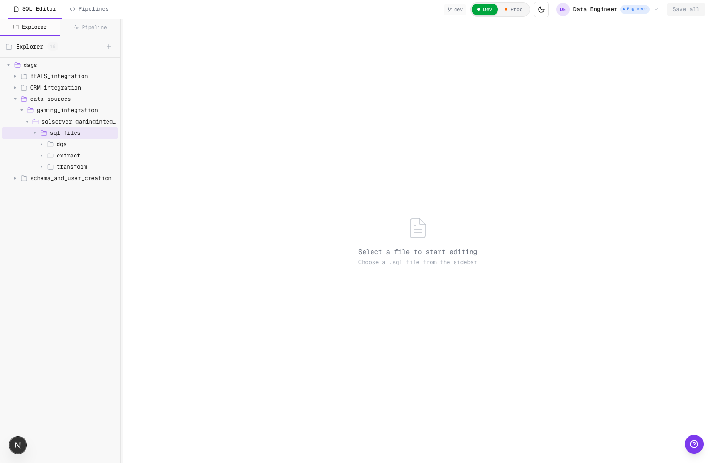
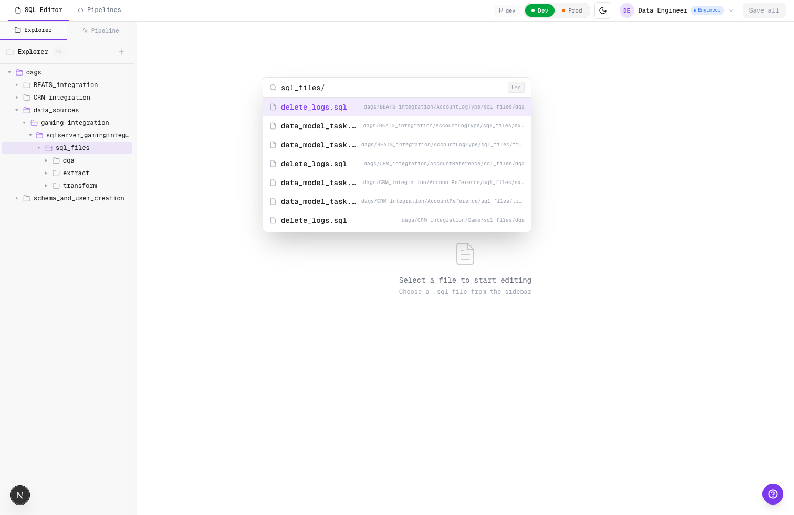
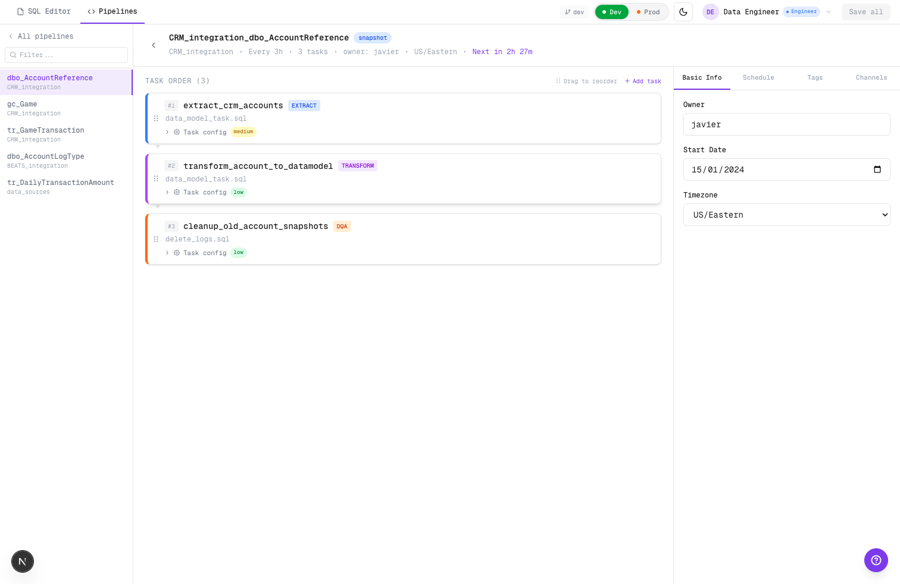

# 2026-02-11 — Phase 2 Stage Folder Alignment

Alcance implementado:
- Migración de paths mock a convención stage-first (`extract/transform/load/dqa`).
- Alineación de `pipeline-mock-data` con paths nuevos.
- Actualización de fixture repo script con estructura stage-first.
- Ajuste de helper de stage detection para nueva convención.

## Qué cambió

### Migración de paths en mock data
- Se reemplazaron referencias `sql_files/transformations/*` por `sql_files/transform/*`.
- Se reemplazaron referencias `sql_files/dml/*` por `sql_files/extract/*`, `sql_files/transform/*` y `sql_files/dqa/*` según task.
- Se migró `schema_and_user_creation/sql_files/schema_creation/schemas.sql` a `schema_and_user_creation/sql_files/load/schemas.sql`.
- Se agregaron entradas faltantes de SQL mock para etapas `extract` y `dqa` en pipelines que solo tenían `transform`.

### Alineación de pipeline tasks
- `ui/src/lib/pipeline-mock-data.ts` ahora apunta a paths stage-first para tasks de negocio.
- Se mantuvo el filtrado DDL en los entrypoints principales sin cambios de política.

### Detección de etapa por path
- `getStageFromPath` ahora reconoce explícitamente:
  - `/extract/` -> `extract`
  - `/transform/` -> `transform`
  - `/load/` -> `load`
  - `/dqa/` -> `dqa`
- Se mantiene compatibilidad backward para paths legacy (`/transformations/`, `/dml/`) como fallback de migración.

### Fixture repo de test
- `scripts/setup-test-repo.sh` ahora crea estructura stage-first para todos los pipelines mock.
- Se alineó también el fixture de `data_sources/gaming_integration/sqlserver_gamingintegration_tr_dailytransactionamount`.
- Se movió `schema_and_user_creation` a `sql_files/load/schemas.sql`.

### Alta de task en Pipeline detail
- En `PipelineDetail`, la creación rápida de SQL ahora crea en `sql_files/transform/` (antes `sql_files/transformations/`).

## Evidencia visual

### Stage-first folders en explorer

### Quick Open con paths stage-first

### Pipeline detail operativo post-migración

## Límites scaffold
- No hay ejecución SQL real ni validación semántica por motor.
- La migración está orientada a coherencia de UX/pathing del scaffold.

## TODO hooks
- Conectar stage folders a validación dinámica de config por task type basada en `configfile_proposal.yml` (fase 4).
- Definir migración explícita de `localStorage` para instalaciones con estado viejo persistido.

## Calidad
- `cd ui && npm run lint` (sin errores; warnings existentes no bloqueantes).
- `cd ui && npm run build` (ok).
- `bash scripts/setup-test-repo.sh /tmp/test-pipeline-repo` (ok; estructura stage-first generada).

## Commit de fase
- _pendiente_
