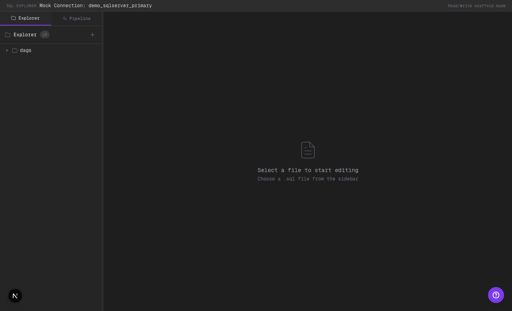
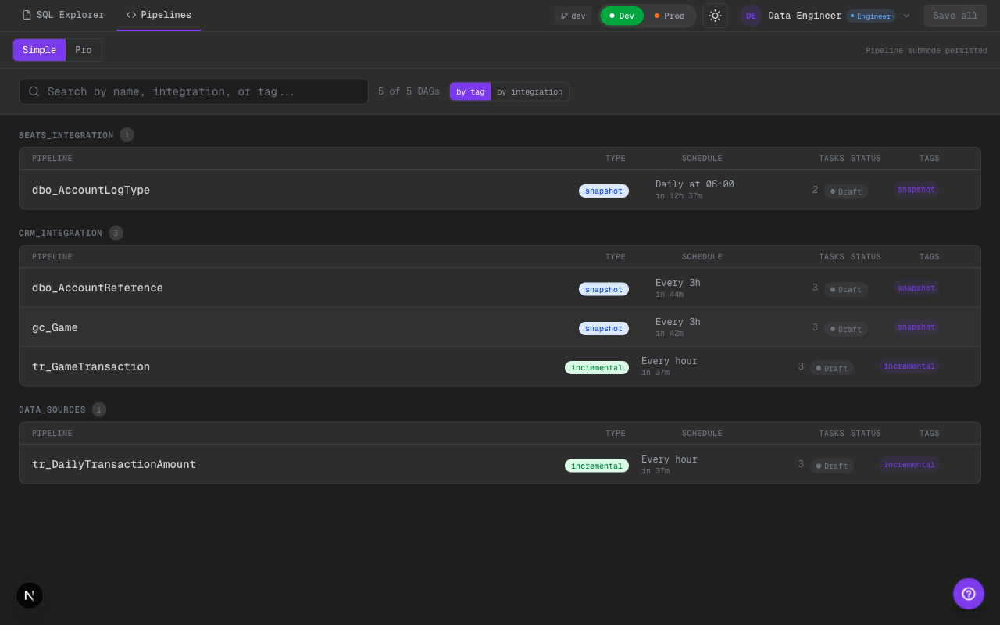
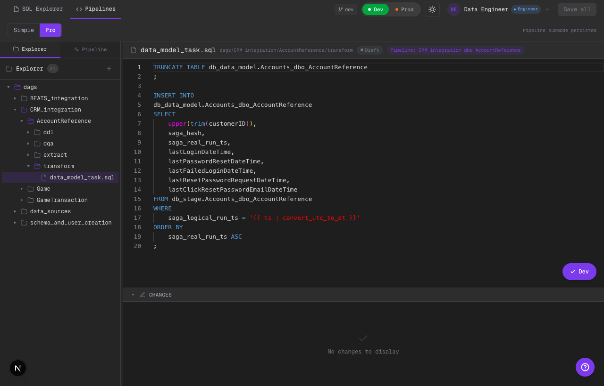

# 2026-02-11 — Phase 3 Information Architecture Refactor

Alcance implementado:
- `SQL Explorer` se rehizo como explorador de base estilo DBeaver (mock).
- `Pipelines` mantiene submodos `Simple` y `Pro` con semántica invertida según feedback.
- Persistencia de submodo de pipelines en store.
- Compatibilidad de rutas existentes (`/editor`, `/pipelines`) mantenida.

## Qué cambió

### Top-level navigation
- Se actualizó el header principal para mostrar `SQL Explorer` en lugar de `SQL Editor`.
- Se mantuvo la clave interna `code` para no romper estado persistido ni rutas existentes.

### SQL Explorer (DB explorer estilo DBeaver)
- `CodeView` ahora muestra:
  - conexión mock (`demo_sqlserver_primary`)
  - árbol `database -> schema -> table`
  - query runner SQL
  - resultados tabulares
- El runner soporta contrato mock orientado a `information_schema.tables` / `information_schema.columns`.
- También permite `SELECT * FROM schema.table` con resultados mock de muestra.

### Pipelines submodes (Simple / Pro)
- Se agregó `pipelineSubMode` en `workspace-store` con persistencia (`simple` por default).
- `PipelineView` ahora renderiza tabs de submodo:
  - `Simple`: board de pipelines (overview/detail con tareas y config DAG), equivalente al modo “pro” anterior.
  - `Pro`: editor de archivos SQL completo (file tree + edición + diff/git flow), equivalente al SQL editor anterior.
- `Quick Open` ahora abre archivo en `Pipelines -> Pro` para mantener el flujo de edición.

## Evidencia visual

### SQL Explorer (dark)

Qué mirar:
- El tab superior dice `SQL Explorer`.
- Se ve el árbol de DB (`db_stage`, schemas, tablas).
- Se ve query SQL ejecutable y resultados de `information_schema`.

### Pipelines Simple (dark)

Qué mirar:
- Tab de submodo con `Simple` activo.
- Se muestra el board de pipelines (search + grupos + filas de pipeline).
- El detalle/orden de tareas se mantiene disponible desde este submodo.

### Pipelines Pro (dark)

Qué mirar:
- Tab de submodo con `Pro` activo.
- Se ve file tree SQL + editor.
- Se ve barra de acciones (`Dev/Prod`, submit, diff/changes), preservando flujo git scaffold.

## Límites scaffold
- `SQL Explorer` sigue sin ejecución real contra motor (mock explícito).
- No se agregó backend real de metadata/catalog; resultado SQL es simulado.

## TODO hooks
- Conectar `SQL Explorer` a metadata real (`information_schema`) cuando exista backend de conexión.
- Evaluar multi-connection real (actualmente una mock).

## Calidad
- `cd ui && npm run lint` (sin errores; warnings existentes no bloqueantes).
- `cd ui && npm run build` (ok).
- Validación visual en Chrome vía Playwright (capturas dark mode).

## Commit de fase
- _pendiente_
