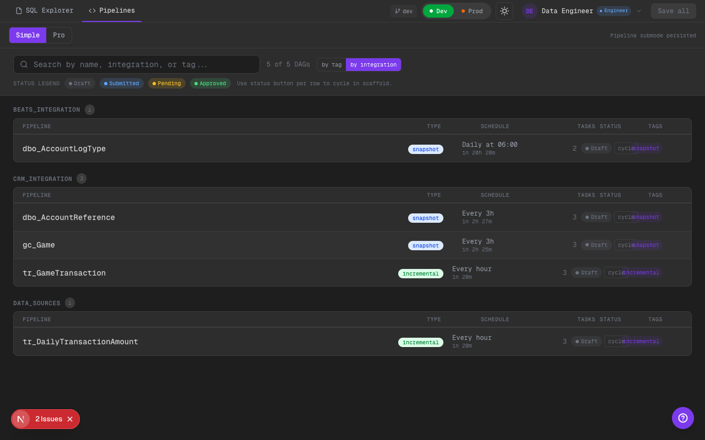
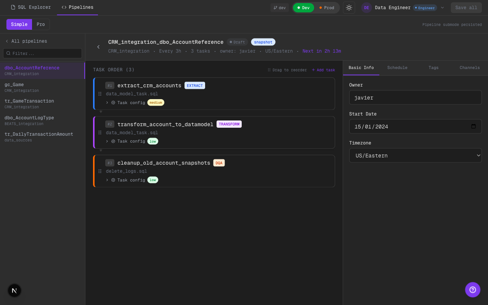
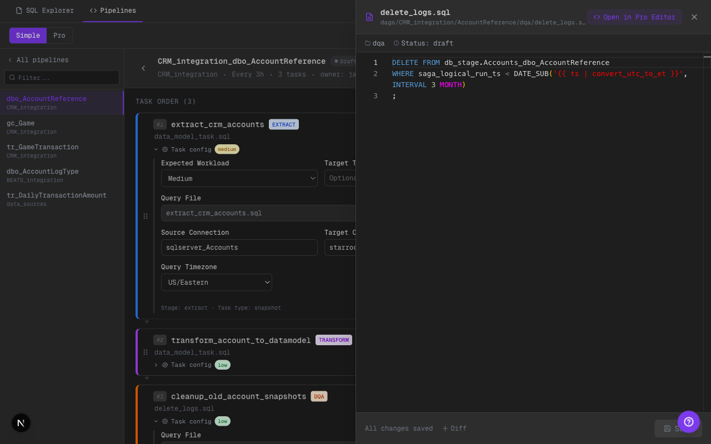
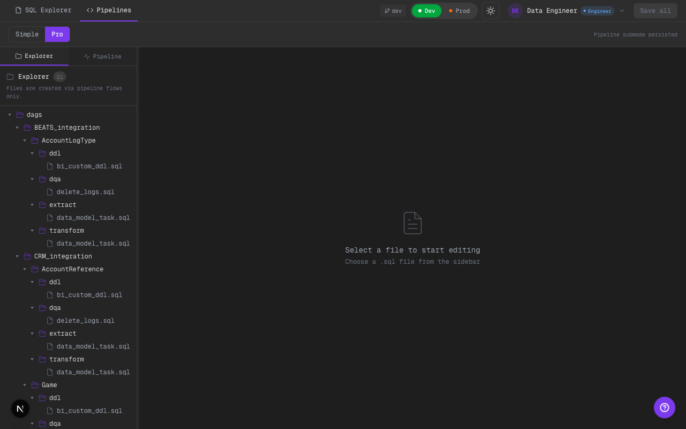
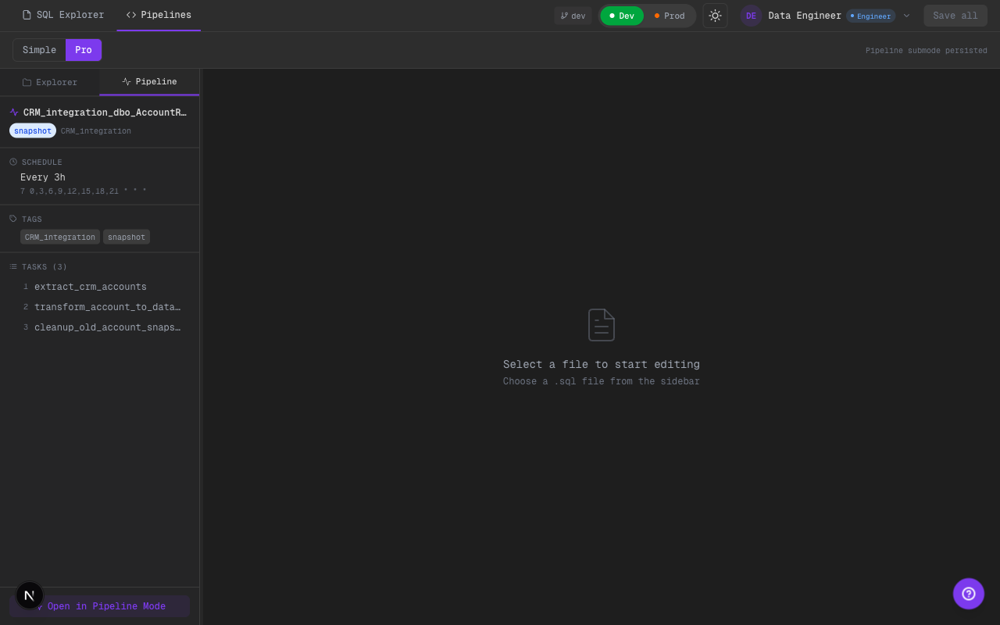

# 2026-02-11 — Phase 4 Pipeline Cohesion + YAML-Driven Task Config

Alcance implementado:
- Cohesión visual/funcional entre overview, detail y pro sidebar para contexto DAG.
- Configuración de task sensible a etapa/tipo alineada al contrato de `configfile_proposal.yml`.
- Agrupación dinámica de pipelines (`by tag` / `by integration`) con columna de estado.
- En `Pipelines Pro`, file tree expandido por default en primera carga y sin creación libre de archivos.

## Qué cambió

### Overview: agrupación y estado de pipeline
- `PipelineOverview` ahora soporta toggle `by tag` y `by integration`.
- Se agregó columna `Status` con `StatusBadge` calculado por pipeline.
- Nuevo helper `getPipelineStatus(...)` para derivar estado agregado en base a tasks no-DDL.

### Detail: estado agregado en header
- `PipelineDetail` muestra badge de estado del pipeline junto al tipo (`snapshot` / `incremental`).
- El badge usa la misma lógica agregada que el overview para evitar desalineaciones.

### Task Config: campos por etapa/tipo
- `TaskConfigPanel` ahora diferencia explícitamente etapas:
  - `extract`: muestra `Expected Workload` + `Target Table Name`.
  - `transform`: no muestra target connection.
  - `load` y `dqa`: mantienen campos/variantes relevantes.
- Se agregó `targetTableName` al tipo `TaskConfig`.
- Se agrega pie de contexto `Stage · Task type` para lectura rápida.

### Pipelines Pro: contexto DAG desde folder root
- Se corrigió la resolución de contexto DAG desde `selectedFolder` aun cuando no hay `selectedFile`.
- Al seleccionar carpeta raíz del pipeline y abrir tab `Pipeline`, se muestra panel DAG correspondiente.

### Guardrail de scaffold en Pro
- Se quitó creación libre de SQL desde el file tree en `Pipelines Pro`.
- Mensaje explícito: creación de archivos solo vía flujos de pipeline.

## Evidencia visual

### Overview grouped by integration + status (dark)

Qué mirar:
- Toggle `by integration` activo.
- Columna `Status` visible por pipeline.
- Agrupación cambia de tags a integración sin romper conteos.

### Pipeline detail con status badge (dark)

Qué mirar:
- En el header del detalle aparece badge de estado agregado.
- Estado visible junto a tipo y metadata DAG.

### Task config extract (dark)

Qué mirar:
- Task `EXTRACT` con `Expected Workload` y `Target Table Name`.
- `Target Connection` visible para extract.

### Task config dqa (dark)

Qué mirar:
- Task `DQA` expone opciones de validación/alerta.
- Pie `Stage · Task type` visible para contexto rápido.

### Pro explorer expandido (dark)

Qué mirar:
- Tree aparece expandido por default en primera carga.
- Stages `extract/transform/load/dqa/ddl` quedan visibles sin navegación extra.

### Pro root folder -> pipeline context (dark)

Qué mirar:
- Tab lateral `Pipeline` activo en `Pipelines Pro`.
- Con carpeta raíz seleccionada se renderiza contexto DAG correcto (no `No pipeline context`).

## Límites scaffold
- Contrato YAML aplicado a nivel UI/configuración, sin validación semántica profunda runtime.
- El status agregado usa estado local de archivos/tasks mock.

## TODO hooks
- Conectar validación de `TaskConfig` a parser real del YAML de contrato.
- Reusar status agregado en futuras vistas de auditoría/approvals para evitar lógica duplicada.

## Calidad
- `cd ui && npm run lint` (ok, warnings existentes no bloqueantes).
- `cd ui && npm run build` (ok).
- Validación visual en Chrome (Playwright) con screenshots dark mode.
