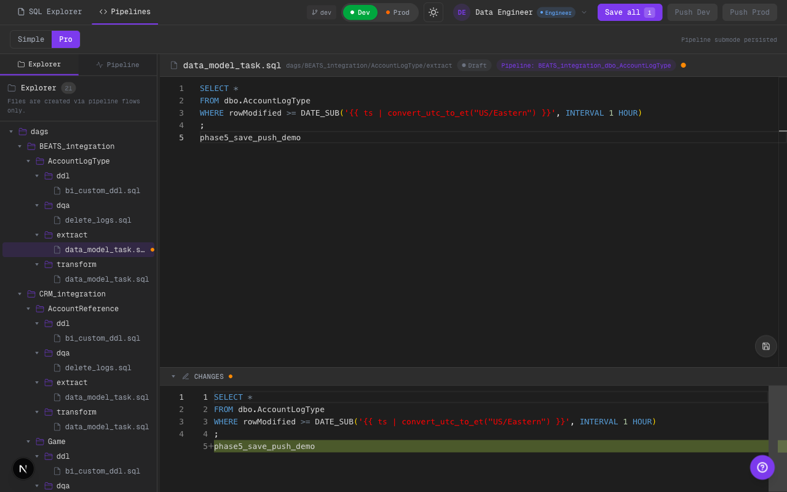
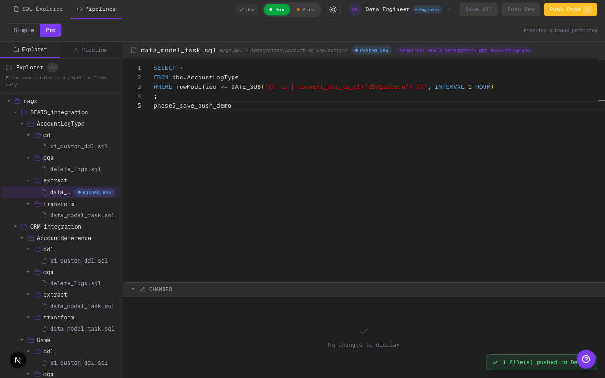
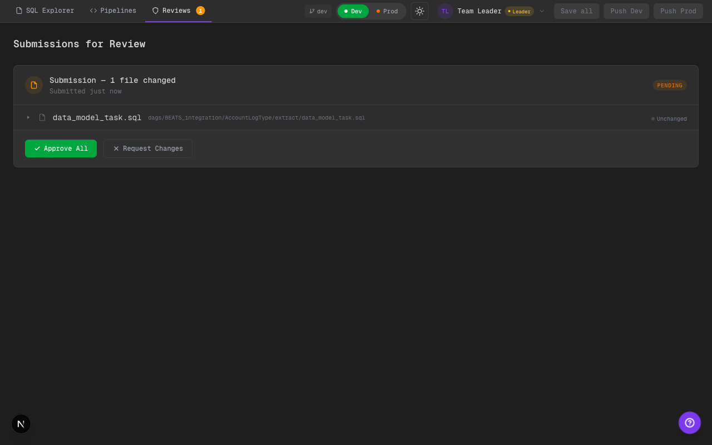

# 2026-02-11 — Phase 5 Save/Push Workflow Reframe

Alcance implementado:
- Se eliminó la acción legacy de submit por archivo.
- Flujo principal pasa a `Save all` + `Push Dev` + `Push Prod` a nivel workspace.
- Nuevo estado visual explícito para "guardado local, todavía no pusheado".
- `Reviews` de líder se mantiene operativo con `pending_approval`.

## Qué cambió

### Estados y semántica
- Nuevo `FileStatus`: `saved_local`.
- `saveFile` ahora marca `saved_local` cuando corresponde.
- Mapeo visual actualizado:
  - `Draft` = editable / no guardado
  - `Saved` = guardado local (naranja)
  - `Pushed Dev` = empujado a dev
  - `Pending Review` = push a prod pendiente aprobación

### Acciones workspace-level
- `UnifiedHeader` ahora expone:
  - `Save all`
  - `Push Dev`
  - `Push Prod`
- Se agregaron acciones de store:
  - `pushToDev()`
  - `pushToProd()`
- `Push Prod` muestra confirmación mock de PR/notificación (`MOCK-PR-xxxxx`).

### Remoción de submit por archivo
- `EditorActionButtons` quedó solo con guardado rápido local.
- Ya no hay botón de submit por archivo en el editor.

### Consistencia transversal
- `StatusBadge` y `pipeline-status` actualizados para incluir `saved_local`.
- Header y vistas de pipeline reflejan el nuevo ciclo de estado.

## Evidencia visual

### Unsaved: push deshabilitado (dark)

Qué mirar:
- `Save all` habilitado por cambios pendientes.
- `Push Dev` / `Push Prod` deshabilitados mientras no haya guardado local.

### Saved local: listo para push (dark)

Qué mirar:
- Estado del archivo pasa a `Saved` (naranja).
- `Push Dev` y `Push Prod` se habilitan a nivel workspace.

### Push Dev aplicado (dark)

Qué mirar:
- Estado pasa a `Pushed Dev`.
- Toast confirma cantidad de archivos pusheados.

### Push Prod + PR mock (dark)

Qué mirar:
- Estado pasa a `Pending Review`.
- Toast incluye `PR MOCK-PR-... notified (mock)`.

### Reviews operativo para líder (dark)

Qué mirar:
- Tab `Reviews` visible para líder con contador.
- Se muestra submission pendiente tras push a prod.

## Límites scaffold
- Push sigue siendo integración mock (no PR real en proveedor git).
- Se hacen llamados API por archivo en lote, sin orchestration backend.

## TODO hooks
- Reemplazar `MOCK-PR-*` por creación real de PR + tracking id.
- Consolidar push batch en endpoint único transaccional.

## Calidad
- `cd ui && npm run lint` (ok, warnings existentes no bloqueantes).
- `cd ui && npm run build` (ok).
- Validación visual en Chrome (Playwright) con screenshots dark mode.
