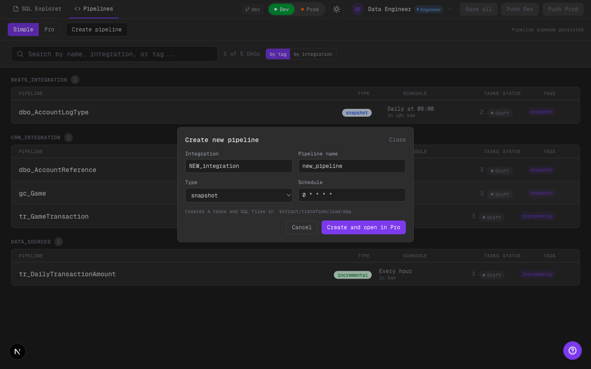
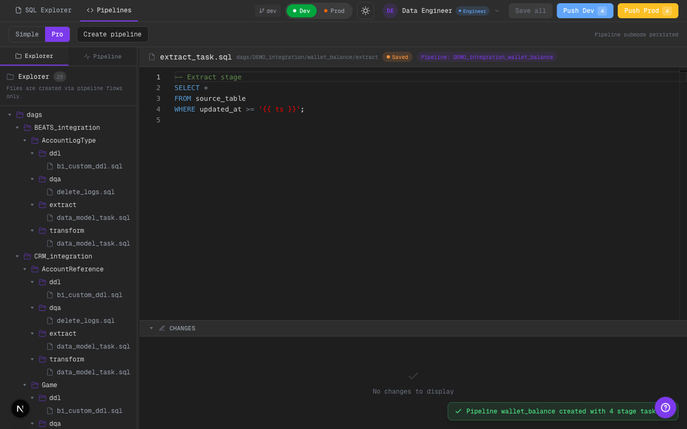
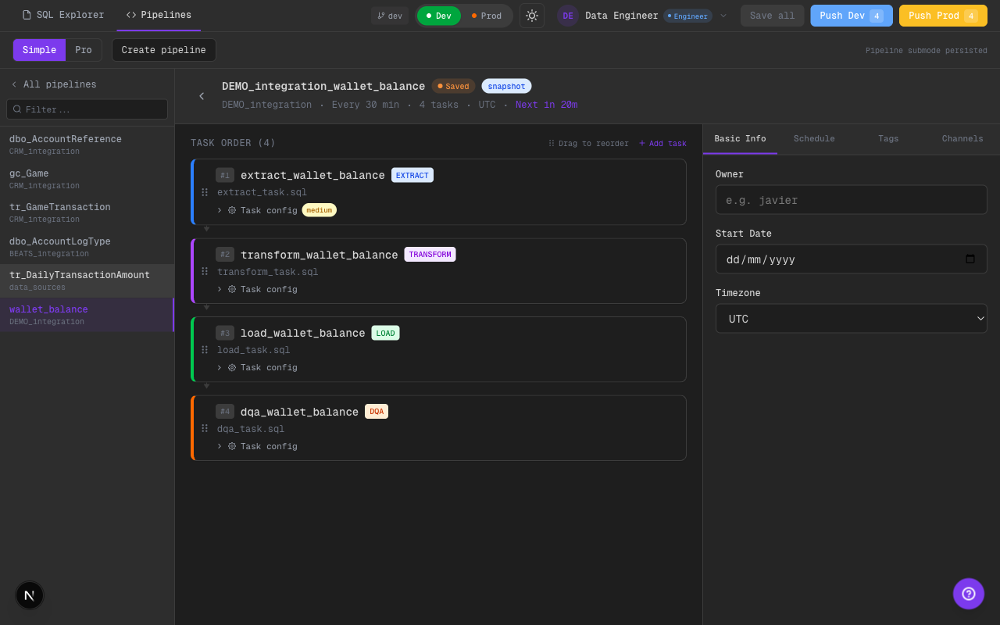

# 2026-02-11 — Phase 6 Create Pipeline + DnD Hardening

Alcance implementado:
- Alta rápida de pipeline en 1 paso, disponible desde `Pipelines`.
- Seed inicial automático de DAG + tasks + SQL stage-first.
- Hardening del reorder para coexistir con tasks DDL ocultas.
- Persistencia validada de pipeline nuevo y task list tras reload.

## Qué cambió

### Create pipeline (1-step)
- `PipelineView` incorpora botón `Create pipeline` visible tanto en contexto simple como pro.
- Modal de 1 paso con:
  - `integration`
  - `pipeline name`
  - `type` (`snapshot` / `incremental`)
  - `schedule`
- Al crear:
  - genera `DagConfig` nuevo,
  - genera 4 tasks (`extract/transform/load/dqa`),
  - genera SQL files semilla en el tree,
  - abre flujo en `Pipelines -> Pro` con primer archivo seleccionado.

### Seed stage-first completo
- Nuevos paths de seed:
  - `.../extract/extract_task.sql`
  - `.../transform/transform_task.sql`
  - `.../load/load_task.sql`
  - `.../dqa/dqa_task.sql`
- Se usan defaults de config consistentes con contrato scaffold/YAML.

### DnD hardening
- `reorderTask` ahora reordena solo tasks visibles (no-DDL) y preserva DDL ocultas en su lugar.
- Se evita desalineación de índices cuando el detalle oculta tasks de sistema DDL.

### Persistencia
- Pipeline nuevo y task ordering persisten en `pipeline-store-v2` + archivos seed en `editor-store-v2`.
- Reload conserva pipeline creado y su task list.

## Evidencia visual

### Modal alta rápida (dark)

Qué mirar:
- Modal de 1 paso con campos mínimos de alta.
- CTA `Create and open in Pro`.

### Pipeline creado en Pro (dark)

Qué mirar:
- Nuevo folder `DEMO_integration/wallet_balance` en file tree.
- SQL stage-first generado y primer archivo abierto.

### Pipeline creado en Simple (dark)

Qué mirar:
- Pipeline nuevo visible en lista simple.
- Detalle muestra tasks seed `extract/transform/load/dqa`.

### Persistencia tras reload (dark)

Qué mirar:
- Pipeline nuevo sigue presente después de recargar.
- Task list se conserva en estado persistido.

## Límites scaffold
- La creación de pipeline aún es mock/persist frontend (sin provisioning real en repo externo).
- El entorno Playwright CLI actual bloqueó automatización directa del comando `drag` (error de parseo de argumentos), por lo que el hardening DnD se valida en código + persistencia funcional del store.

## TODO hooks
- Conectar alta rápida a creación real de estructura en repo externo.
- Agregar cobertura e2e estable para drag/drop cuando el comando `drag` del runner quede operativo.

## Calidad
- `cd ui && npm run lint` (ok, warnings existentes no bloqueantes).
- `cd ui && npm run build` (ok).
- Validación visual en Chrome (Playwright) con screenshots dark mode.
