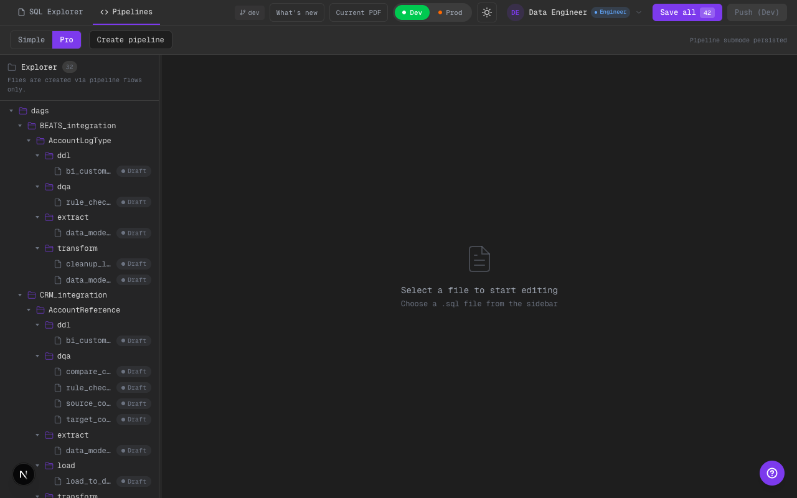

# Phase 10: Pro Folder Focus muestra Pipeline Summary (no pantalla vacía)

## Alcance implementado
- En Pro mode, si el usuario selecciona un folder (pipeline root) y no un archivo, el panel principal ya no queda vacío.
- Se muestra un resumen de pipeline (misma info que el panel de contexto), con edición de DAG params y acceso a tasks.

## Qué cambió
- `EditorPanel` detecta `selectedFolder` y resuelve el DAG asociado.
- Cuando hay pipeline detectado, renderiza `PipelineSidebarPanel` en el panel principal como “Pipeline summary”.

## Límites scaffold
- Es un resumen UI-only: no hay ejecución real de pipeline ni checkout de branches.
- La selección de pipeline por folder es heurística (integration + folderName).

## Evidencia visual (dark)

### Folder focus en Pro: se ve resumen de pipeline

Qué mirar:
- El panel principal muestra “Pipeline summary” en lugar del empty state “Select a file…”.
- Se ven tasks + status badges y se puede clickear para abrir el SQL.

## TODO (futuro)
- Hacer el mapping folder -> pipeline más explícito (sin heurística por nombre).
- Agregar evidencia visual de “click task -> abre SQL” en la misma captura o una adicional.

