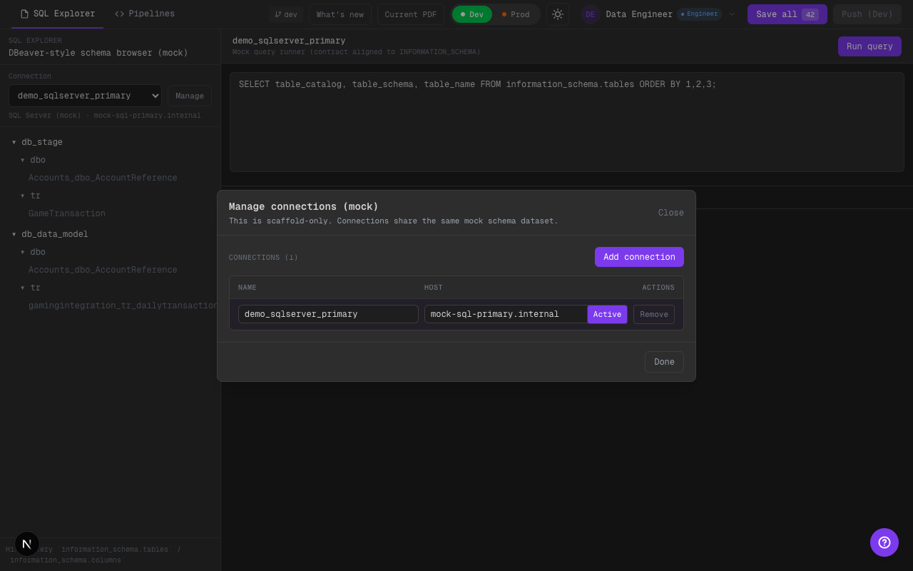

# Phase 11: SQL Explorer (DBeaver-style) + Manage Connections (mock)

## Alcance implementado
- SQL Explorer ahora soporta gestionar conexiones mock (add/edit/remove).
- Se mantiene el schema browser estilo DBeaver y el runner mock alineado a `INFORMATION_SCHEMA`.

## Qué cambió
- Nuevo store persistente: `sql-explorer-store-v1` con:
  - `connections[]`
  - `activeConnectionId`
  - acciones de `add/update/remove`
- En SQL Explorer:
  - Botón `Manage` abre modal de conexiones.
  - Conexiones agregadas comparten el mismo dataset mock (scaffold), pero permiten demostrar UX multi-conn.

## Límites scaffold
- No hay conexiones reales a DB; es solo UX mock.
- “Run query” sigue ejecutando el mock runner (solo INFORMATION_SCHEMA y SELECT básico).

## Evidencia visual (dark)

### Modal `Manage connections`

Qué mirar:
- Se ve el botón `Manage` junto al selector de connection.
- El modal permite editar `Name` / `Host`, seleccionar `Use` y remover conexiones (dejando al menos 1).

## TODO (futuro)
- Agregar “Add connection” con wizard más guiado (tipo DBeaver) si se necesita demo más fuerte.
- Si se integra DB real: mapear “connection” a credenciales/secret manager con RBAC.

