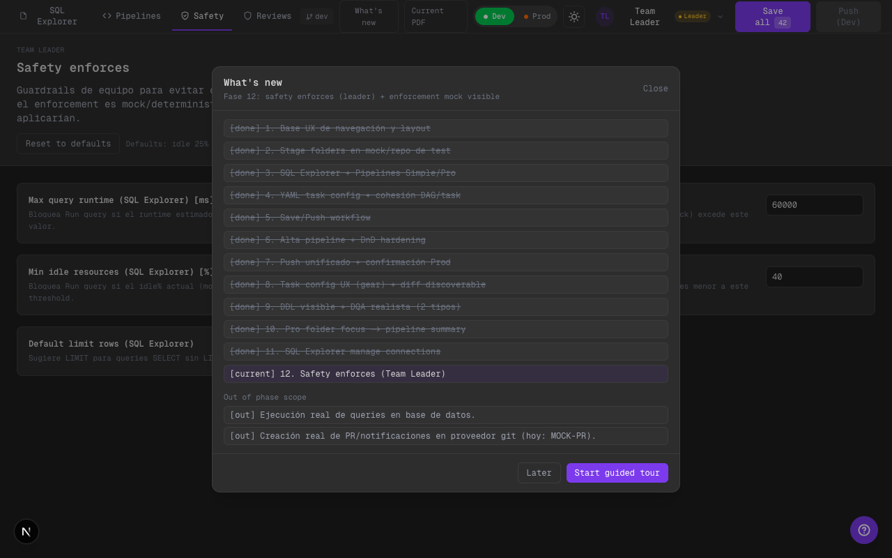
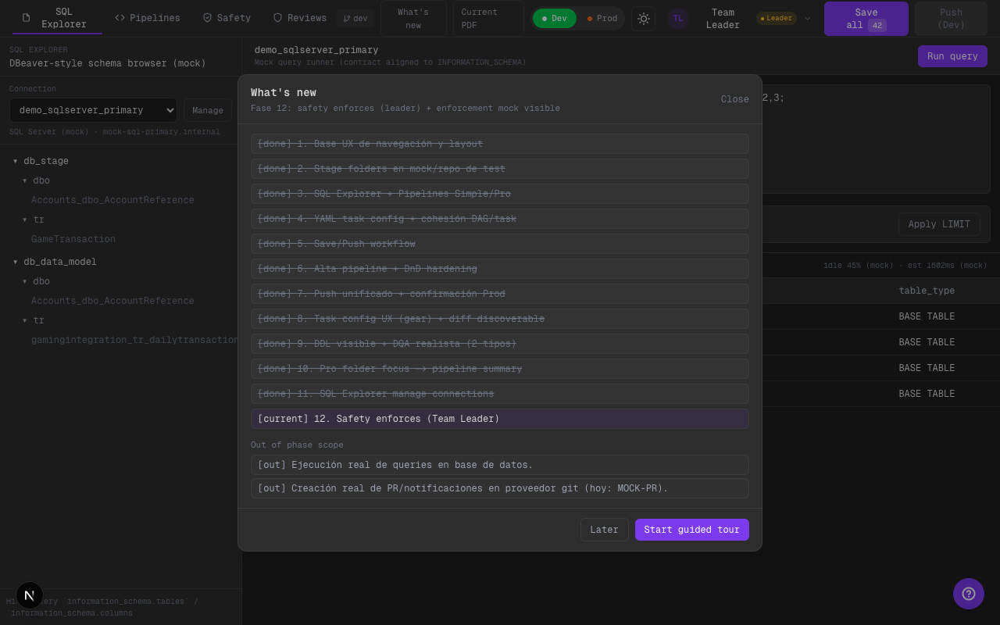

# Phase 12: Safety Enforces (Team Leader) + Enforcement Visible (mock)

## Alcance implementado
- Nuevo tab leader-only: `Safety`.
- Config global (por browser) con guardrails:
  - Max runtime (SQL Explorer)
  - Max runtime (SQL Pipes)
  - Min idle% (SQL Explorer)
  - Min idle% (SQL Pipes)
  - Default LIMIT rows (SQL Explorer)
- Enforcement mock/determinístico:
  - SQL Explorer: `Run query` puede bloquearse con mensaje explícito.
  - SQL Pipes: botón `simulate run` respeta las mismas reglas (mock).

## Qué cambió
- Nuevo store persistente: `safety-store-v1`.
- `WorkspaceShell` agrega vista `SafetyEnforcesView`.
- `UnifiedHeader` agrega tab `Safety` solo para Team Leader.
- `CodeView` aplica guardrails antes de ejecutar el mock runner.
- `PipelineSidebarPanel` agrega `simulate run` para evidenciar guardrails en pipes.

## Límites scaffold
- Idle% y runtime son estimaciones mock (determinísticas) para demo.
- No hay ejecución real de SQL ni telemetría real de recursos.

## Evidencia visual (dark)

### Tab `Safety enforces`

Qué mirar:
- El tab `Safety` aparece solo para Team Leader.
- Se ven los 5 guardrails editables (ms, %, limit).

### Enforcement visible en SQL Explorer (blocked)

Qué mirar:
- `Run query` devuelve un resultado “Blocked by Safety enforces …”.
- Se ve el indicador con `idle %` y `estimated runtime` (mock) en la barra de estado.

## TODO (futuro)
- Integrar enforcement real con un query runner real y métricas reales de recursos.
- Registrar “blocked events” para auditoría y seguimiento (scaffold -> real).

