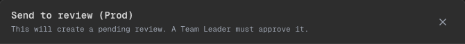

# Phase 13 — Status labels humanos + modal Prod más claro

## Alcance implementado
- Centralicé la UI de estados (`Draft/Saved/Pushed Dev/Pending Review/Approved`) para evitar enums crudos en pantallas clave.
- Mejoré el modal de `Push (Prod)` para que muestre:
  - badges humanos en vez de `pending_approval` literal,
  - texto de diff accionable (`Ready` / `Uncommitted changes`),
  - explicación más directa de “qué pasa ahora”.

## Qué cambió
- Nuevo helper `STATUS_UI` como source-of-truth de:
  - label visible,
  - significado (tooltip/copy),
  - clases visuales del badge.
- `StatusBadge` ahora consume ese helper (evita duplicación).
- `Push (Prod)` confirm modal ahora renderiza `StatusBadge` para “Current” y “Next”.

## Evidencia visual

- Qué mirar:
- En la tabla, la columna “Current” y “Next” muestran badges humanos (no enums).
- “Next” se ve como `Pending Review`, reforzando que requiere aprobación TL.
- La columna “Diff” dice `Ready` (o `Uncommitted changes` si corresponde), no `clean/has diff`.

## Límites scaffold
- La creación de PR real sigue mock (el modal lo aclara). No hay integración real con Bitbucket/PRs todavía.

## TODO (hooks futuros)
- Si se integra PR real, mapear “Pending Review” a estados reales del proveedor (PR open/approved/merged) y reflejarlo en la UI.

