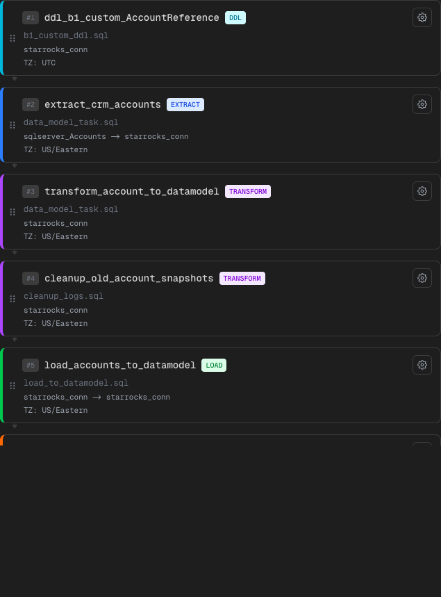

# Phase 15 — Pipeline cards con “config summary” + status badges consistentes (Simple/Pro)

## Alcance implementado
- En el listado de tasks del pipeline, cada card muestra 1–2 líneas de resumen de config (sin abrir YAML):
  - conexiones (source -> target) y timezone
  - DDL: indicación de cambio de schema / target table (si aplica)
  - DQA: distingue “rule check” vs “source vs target” + métrica
- En Pro (`SqlEditorSlideOut`), el status del archivo ahora se muestra con `StatusBadge` (no enum crudo).
- Fix de HTML inválido en overview: se eliminó el `<button>` anidado (fila clickeable dejó de ser `button` y pasó a `div role=button`).

## Qué cambió
- `PipelineTaskCard` agrega `summaryLines` derivadas de `task.taskConfig` (máx 2 líneas).
- `SqlEditorSlideOut` muestra `StatusBadge` + tooltip de significado.
- `PipelineOverview` evita nested `<button>` para eliminar warnings/hydration errors.

## Evidencia visual

- Qué mirar:
- Debajo del nombre de archivo, aparecen líneas cortas (ej: `sqlserver_Accounts -> starrocks_conn`, `TZ: US/Eastern`).
- En DQA, el resumen diferencia “rule check” vs “source vs target”.
- El layout sigue siendo compacto (no obliga a abrir el panel de config para entender qué hace la task).

## Límites scaffold
- El “summary” es UI-driven: no ejecuta validaciones reales ni parsea YAML real (todavía).

