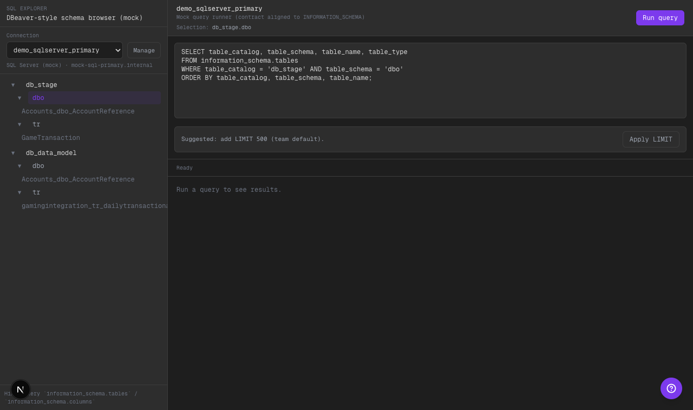

# Phase 16 — SQL Explorer: clicks estilo DBeaver + breadcrumb de selección

## Alcance implementado
- Separé affordances en el browser:
  - caret: expand/collapse
  - click en nombre de schema: prepara query `INFORMATION_SCHEMA` para listar tables
  - click en table: prepara query para listar columns
- Agregué breadcrumb de selección visible en el panel principal (`Selection: db.schema[.table]`).
- Mejoré highlights de selección para que el “focus” sea obvio.

## Qué cambió
- `CodeView` introduce estado de selección:
  - `activeDb`, `activeSchemaKey`, `activeTable`
- `SchemaBrowser` renderiza filas con caret separado del label y aplica estilos de “active”.

## Evidencia visual

- Qué mirar:
- En el tree, el caret (▾/▸) no dispara queries: sólo expande/colapsa.
- Click en `dbo` (schema) setea `Selection: db_stage.dbo` y prepara la query de `information_schema.tables`.
- La selección activa se ve resaltada (no hay duda de dónde estás parado).

## Límites scaffold
- La ejecución sigue siendo mock, pero el UX se alinea a muscle memory de herramientas tipo DBeaver.

