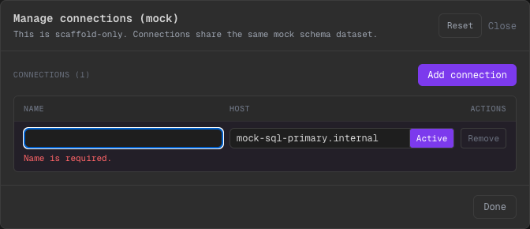

# Phase 17 — Manage connections: guardrails UX (validación + reset + empty state)

## Alcance implementado
- Manage connections ahora es más demostrable y “pro”:
  - validación visible (name/host requeridos)
  - acción `Reset` para volver a conexiones seed (demo)
  - empty state cuando no hay conexiones (si el store queda vacío)
  - confirm al borrar la conexión activa

## Qué cambió
- `CodeView` (modal Manage):
  - inputs con borde rojo + mensaje cuando están vacíos
  - botón `Reset` (scaffold-only) que rehidrata el seed store
  - `Remove` de la conexión activa pide confirmación

## Evidencia visual

- Qué mirar:
- Al vaciar el name, aparece error `Name is required` y el borde se marca en rojo.
- `Reset` está visible para volver rápido a defaults en una demo.
- No deja borrar si quedaría 0/1 conexión (guardrail).

## Límites scaffold
- Estas conexiones son mock y comparten el mismo dataset; la UI simula “manage conns” sin tocar ningún DB real.

