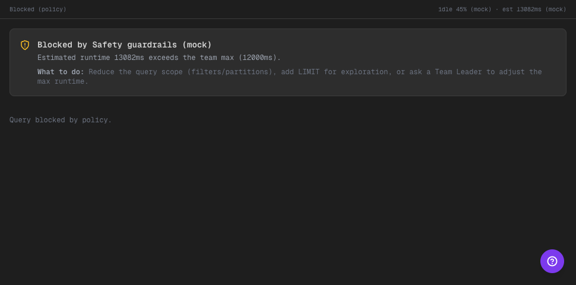

# Phase 18 — Safety guardrails: mensajes accionables + naming consistente

## Alcance implementado
- “Safety enforces” pasó a mostrarse como **Safety guardrails** (naming consistente en UI/copy).
- El bloqueo de queries en SQL Explorer ahora se comunica como un **callout product-like**:
  - qué regla bloqueó (idle% o runtime)
  - valores (actual vs threshold)
  - “What to do” con sugerencias concretas
- Mantiene métricas mock visibles (`idle%` y `est runtime`) para demo.

## Qué cambió
- `CodeView` agrega `policyBlock` state y renderiza un callout cuando el enforcement bloquea `Run query`.
- `SafetyEnforcesView` actualiza heading a “Safety guardrails”.
- Copy actualizado en:
  - Joyride checklist (`WhatNewGuide`)
  - tooltip del botón `simulate run` en pipeline context.

## Evidencia visual

- Qué mirar:
- El panel muestra “Blocked by Safety guardrails (mock)” con el motivo exacto (runtime) y el threshold.
- Hay un “What to do” explícito (reducir scope/usar LIMIT/ajustar max runtime via TL).
- Se siguen viendo las métricas mock arriba (idle/est).

## Límites scaffold
- Enforcement es determinístico/mock; no hay evaluación real de costo ni ejecución real contra DB.

