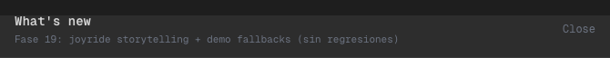

# Phase 19 — What’s new + Joyride: storytelling ordenado y checklist actualizado

## Alcance implementado
- Actualicé el checklist “What’s new” para reflejar las phases nuevas (13–19).
- Reordené el Joyride para contar una historia más natural:
  - primero entender estados (status legend),
  - luego crear pipeline,
  - después save -> elegir Dev/Prod -> push,
  - y (si sos TL) Safety + Reviews.
- Bump de versión para que el modal se reabra una vez (por cambio relevante de flujo).

## Qué cambió
- `WhatNewGuide`:
  - `WHATS_NEW_VERSION` nuevo (`phase19-guide-v1`)
  - `planItems` extendido hasta phase 19
  - steps reordenados para que cada target muestre un “cambio visible” o explique el next action

## Evidencia visual

- Qué mirar:
- Se ve la lista con phases 1–18 como `[done]` y la 19 como `[current]`.
- El CTA `Start guided tour` está disponible para ejecutar el walkthrough actualizado.

## Límites scaffold
- La guía no “inventa” backend real: PRs/DB execution siguen mock, pero la historia guía a una demo creíble.

