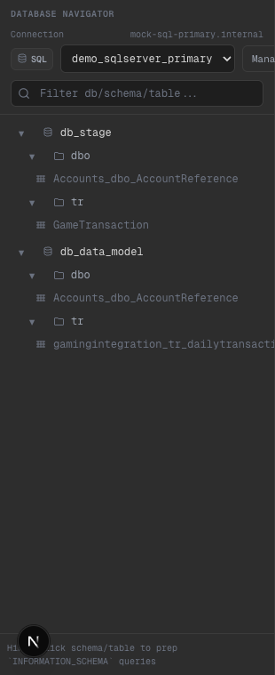

# Phase 21 — SQL Explorer: engine icon en connection (SQL/PG)

## Alcance implementado
- En el `Database Navigator`, la conexión ahora muestra un “engine chip” visible (estilo DB client):
  - `SQL` para SQL Server
  - `PG` para Postgres
- El chip aparece:
  - al lado del selector de connection (navigator)
  - en el header del panel principal junto al nombre/engine

## Evidencia visual

- Qué mirar:
- En el header de connection se ve un chip `SQL` (o `PG` según engine) antes del dropdown.
- En el panel principal, el engine se muestra acompañado del mismo chip (se siente “DB explorer”, no file tree).

## Límites scaffold
- El chip es UI-driven a partir de `connection.engine` del mock store; no implica drivers reales.

