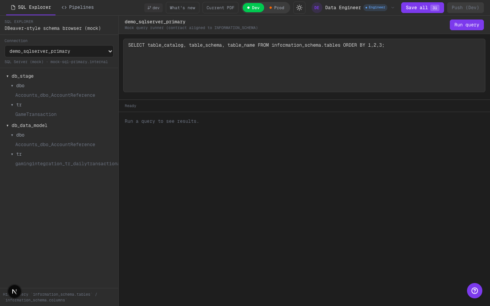

# Phase 7: Push Unificado + Confirmación Prod

## Alcance implementado
- Un solo botón `Push` en el header. El destino depende del toggle `Dev/Prod`.
- En `Prod`, `Push` abre un modal de confirmación con summary y aclaración de aprobación por Team Leader.

## Qué cambió
- Se reemplazó `Push Dev` / `Push Prod` por `Push (Dev|Prod)` (env-driven).
- Se agregó modal de confirmación para `Prod` con:
  - lista de archivos incluidos,
  - estado actual vs estado destino,
  - recordatorio de “Team Leader approval required”.
- Joyride/What’s new actualizado para reflejar `Push` unificado + toggle de environment.

## Límites scaffold
- No hay PR real: sigue siendo mock (ej: `MOCK-PR-*`).
- No hay validación de git repo en todos los casos (graceful degradation).

## Evidencia visual (dark)

### Header con `Push (Dev)`

Qué mirar:
- Solo existe un botón `Push` (no hay `Push Dev` y `Push Prod`).
- El label muestra el environment actual: `Push (Dev)`.

### Confirmación al hacer `Push (Prod)`

Qué mirar:
- Al estar en `Prod`, el click abre el modal (no hace push directo).
- El modal lista archivos incluidos y muestra `pending_approval` como destino.
- Se ve el texto que explicita que un Team Leader debe aprobarlo en `Reviews`.

## TODO (futuro)
- Reemplazar mock PR por PR real (Bitbucket/Git provider).
- Mejorar el summary con stats de diff (líneas +/-, o preview acotado) sin romper rendimiento.

