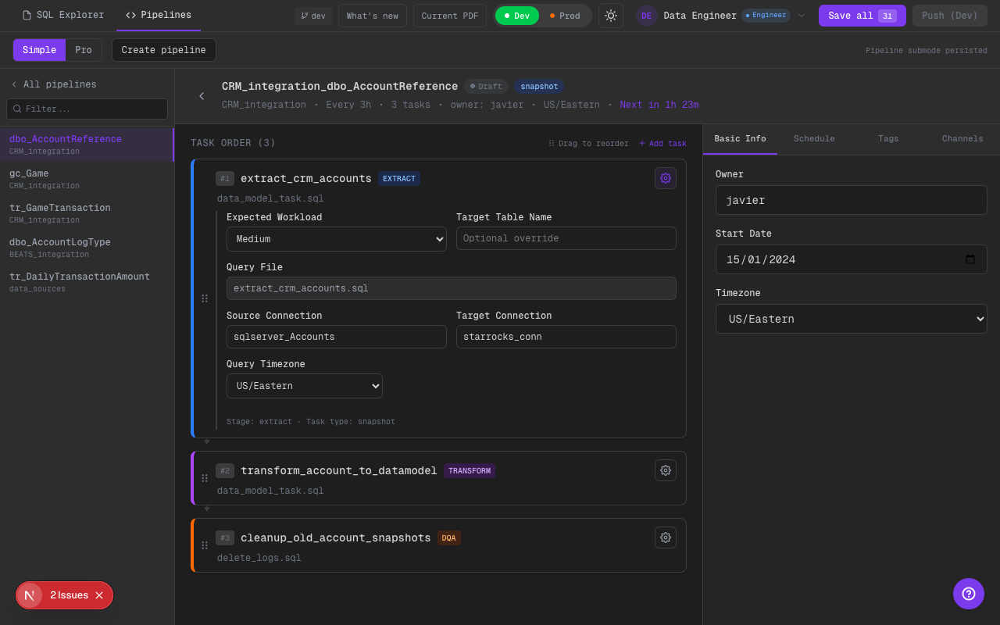

# Phase 8: Task Editor Legible (Config Gear en Header)

## Alcance implementado
- La configuración de cada task se abre desde un botón “gear” en el header del card (lado derecho).
- El panel de config mantiene la misma información/config que antes (solo cambia el affordance).

## Qué cambió
- En la vista Simple del pipeline, cada task card muestra un botón de config (gear) a la derecha.
- El toggle de config ya no compite visualmente con el contenido del card (nombre, stage, filename).

## Límites scaffold
- La config sigue siendo estado mock/persistido en frontend (no escribe YAML real todavía).
- No se agregó ejecución real de DQA ni validación de config (solo UX y claridad).

## Evidencia visual (dark)

### Task card con config gear en header

Qué mirar:
- En el header de la task (misma fila del nombre + badge) se ve el botón gear a la derecha.
- Al hacer click, se despliega el panel de config debajo del card (sin romper el click de “abrir SQL”).

## TODO (futuro)
- Hacer que el panel explique mejor DQA types (single-rule vs source-vs-target) con ejemplos.
- Integración futura: guardar/editar YAML real de task config en repo externo.

