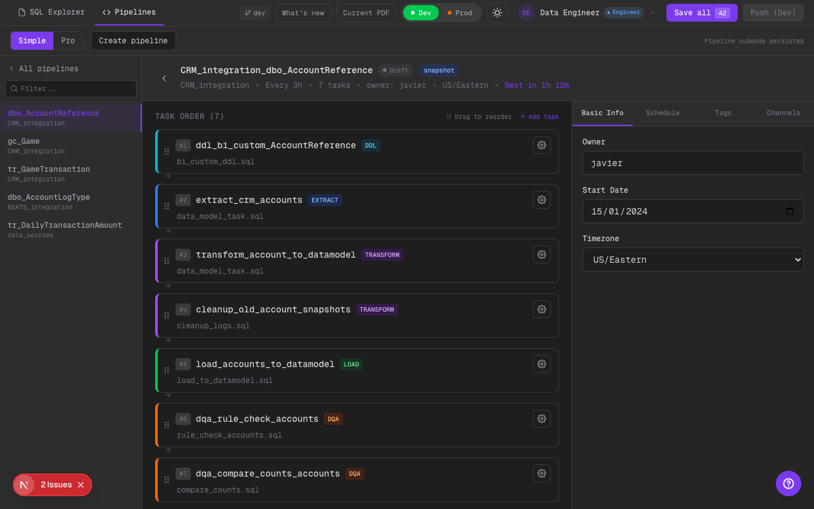
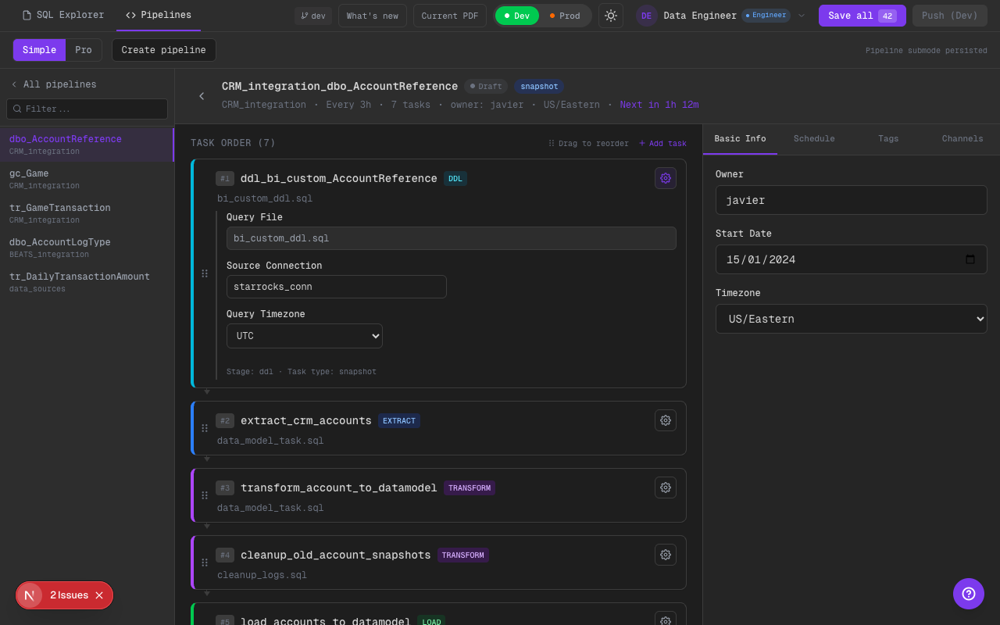

# Phase 9: DDL Visible + DQA Realista (2 tipos) + Cleanup fuera de DQA

## Alcance implementado
- Se agregó stage `ddl` al modelo y UI.
- DDL “sistema” sigue siendo transparente/oculto (create_table_stage / create_table_data_model).
- DDL “BI custom” es visible y se muestra como `DDL`.
- Cleanup (`delete logs` / `delete stage old records`) se movió a `transform` (no es DQA).
- DQA ahora muestra 2 tipos en config:
  - `single_query_notification` (rule check en misma base)
  - `source_vs_target_query_comparison` (2 queries + comparación)

## Qué cambió
- `PipelineStage` ahora incluye `ddl`.
- Pipeline status y conteos ignoran solo DDL “sistema” transparente (no todo DDL).
- Nuevos ejemplos SQL en mock:
  - `transform/cleanup_logs.sql` (cleanup)
  - `dqa/rule_check_*.sql` (tipo 2)
  - `dqa/source_count_by_day.sql` + `dqa/target_count_by_day.sql` + `dqa/compare_counts.sql` (tipo 3)
- Panel de config de DQA expone campos para tipo 3:
  - `sourceQueryFile`, `targetQueryFile`, `comparisonMetric`, `groupBy`.

## Límites scaffold
- La comparación source-vs-target no se ejecuta realmente (scaffold). Los campos existen para que el intent sea demostrable.
- No se genera YAML real de tasks todavía: es estado mock/persistido.

## Evidencia visual (dark)

### Task list con stages incluyendo `DDL` y `DQA`

Qué mirar:
- Se ve al menos un task con badge `DDL` (BI-visible).
- No aparecen los DDL “sistema” (transparentes) en la lista/UI principal.
- Cleanup aparece bajo `TRANSFORM` (no está en DQA).

### Config de DQA tipo 3 (source vs target)

Qué mirar:
- `Query Type` está en `Source vs Target`.
- Se ven los fields `Source Query File` / `Target Query File` / `Metric` / `Group by`.
- Hay nota explícita de scaffold para “comparison execution mocked”.

## TODO (futuro)
- Persistir task config en YAML real dentro del repo externo.
- Si se integra ejecución real, mapear config `source_vs_target` a un runner real (counts/day + tolerancias).

