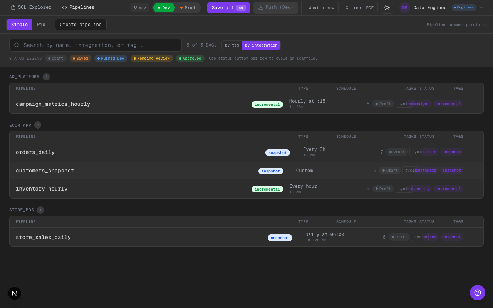
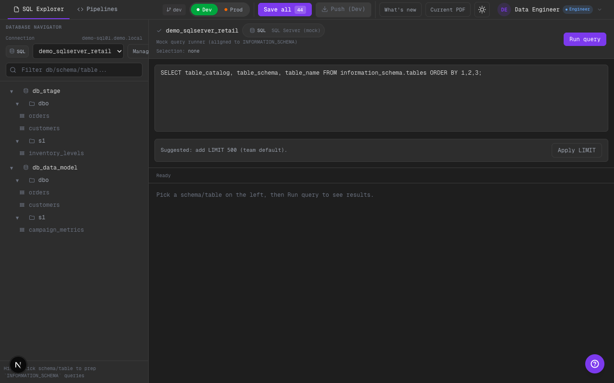

# Phase 22 — Demo data retail/ecommerce (nombres realistas, sin identifiers internos)

## Alcance implementado
- Se renombraron los ejemplos base para que el demo “suene” a retail/ecommerce sin reflejar ningún modelo real:
  - Integrations/pipelines (`ecom_app`, `store_pos`, `ad_platform` + `orders_daily`, `customers_snapshot`, etc).
  - Tablas y queries (`orders`, `customers`, `inventory_levels`, `campaign_metrics`, etc).
- SQL Explorer (mock) ahora muestra bases/schemas/tablas coherentes con ese dominio.
- El fixture de repo local (`scripts/setup-test-repo.sh`) quedó alineado con el nuevo set de paths/nombres.
- `DEMO_MODE` dejó de tener un diccionario hardcodeado con nombres internos (quedó sólo sanitización genérica).

## Evidencia visual

- Qué mirar:
- Los grupos de pipelines son integrations genéricas (`ecom_app`, `store_pos`, `ad_platform`).
- Los pipelines suenan a ecommerce/retail (`orders_daily`, `customers_snapshot`, `inventory_hourly`).
- No aparecen entidades internas/legacy en nombres o tags.

- Qué mirar:
- En `Database Navigator` se ven tablas como `orders`, `customers`, `inventory_levels`, `campaign_metrics`.
- Host/connection del demo es genérico (`demo-sql01.demo.local`) y no sugiere infraestructura real.

## Límites scaffold
- Todo el dataset sigue siendo mock/UI-driven.
- No hay inferencia de metadata real: los nombres son ejemplos para demo y configuración, no “descubrimiento” real.

