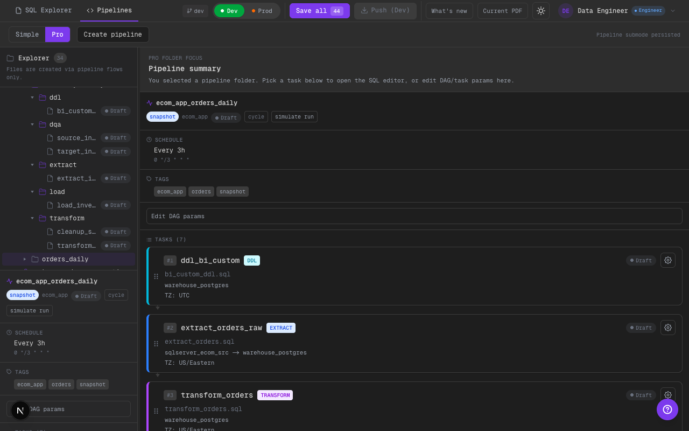

# Phase 23 — Pro: tasks list con cards (paridad visual con Simple)

## Alcance implementado
- En **Pro** (folder focus + panel de contexto), la lista de tasks dejó de ser una lista compacta y ahora usa el mismo estilo de **cards** que el flujo Simple/Pro del pipeline:
  - cards más grandes
  - mismo layout (stage badge + status + config gear + resumen)
  - drag-to-reorder habilitado (mismo comportamiento scaffold que en el detalle del pipeline)
- Se sumó `StatusBadge` a las cards de tasks para que el estado sea visible sin depender de la lista compacta.

## Evidencia visual

- Qué mirar:
- En el panel de `Pipeline summary` se ven cards grandes por task (no una lista finita).
- Cada card muestra `Stage` + `Status` + `config gear` (misma semántica que en Simple).
- La vista aprovecha mejor el espacio (menos “vacío” y menos look-and-feel distinto entre modos).

## Límites scaffold
- El reorder es UI-driven (mock) y actualiza el orden en el store; no hay ejecución real de DAG.

