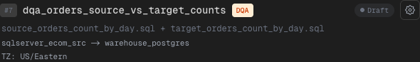
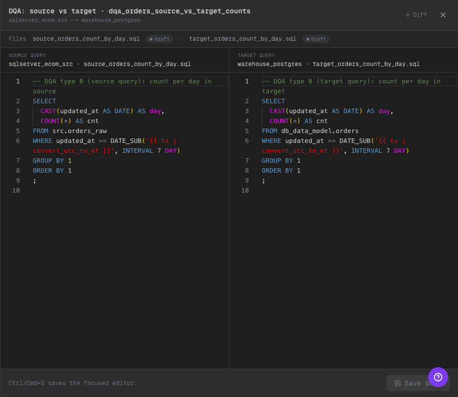

# Phase 24: DQA Multi-file Tasks + Split Editor (Simple/Pro)

## Qué cambió
- DQA ahora soporta el modelo: **1 task puede mapear a 1 o 2 archivos SQL**.
- DQA tipo "source vs target" (2 queries) abre un **split editor** con ambas queries (source y target) en el slide-out.
- El pipeline context (y features como "cycle status") reconocen correctamente tasks que incluyen **múltiples archivos**.
- En la card de DQA compare se muestran ambos filenames: `source_*.sql + target_*.sql` para que sea obvio qué compone la task.

## Qué es scaffold/mock (explícito)
- No hay ejecución real de comparación entre source/target: el objetivo es **demostrar el modelado y la UX** (config + edición + diff + save/push).
- El split editor usa el mismo store mock de archivos y el mismo Monaco editor que el resto del scaffold.

## Evidencia visual (dark mode)

### 1) Card DQA compare (1 task = 2 files)

Qué mirar:
- En la misma card se ven **los 2 filenames** (`source + target`).
- Se ve que sigue siendo **una sola task** (no se duplica en la lista).

### 2) Split editor (source vs target)

Qué mirar:
- Panel derecho con título **"DQA: source vs target"**.
- Se ven **dos editores**: Source query y Target query.
- Se ven los **dos paths** en la barra "Files" y ambos statuses.
- Botón "Diff" aplica por editor (para comparar `saved` vs `modified`).

## Implementación (mapa)
- Multi-file task mapping (helper): `/Users/javier/ui-scaffold/ui/src/lib/task-files.ts`
- Split editor: `/Users/javier/ui-scaffold/ui/src/components/pipeline/DqaSplitEditorSlideOut.tsx`
- Wiring en Simple/Pro (apertura del split editor + mapping):  
  - `/Users/javier/ui-scaffold/ui/src/components/pipeline/PipelineDetail.tsx`  
  - `/Users/javier/ui-scaffold/ui/src/components/PipelineSidebarPanel.tsx`  
  - `/Users/javier/ui-scaffold/ui/src/components/Sidebar.tsx`  
  - `/Users/javier/ui-scaffold/ui/src/components/PipelineContextIndicator.tsx`
- Status/cycle/overview ajustados para tasks con 2 files:  
  - `/Users/javier/ui-scaffold/ui/src/lib/pipeline-status.ts`  
  - `/Users/javier/ui-scaffold/ui/src/components/pipeline/PipelineSimpleView.tsx`  
  - `/Users/javier/ui-scaffold/ui/src/components/pipeline/PipelineOverview.tsx`

## TODO / hooks
- Si en el futuro se ejecuta DQA tipo compare de verdad: agregar "comparison result panel" (counts por dia + diff) y wiring con backend real.

