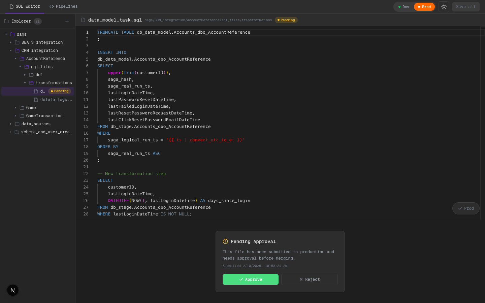
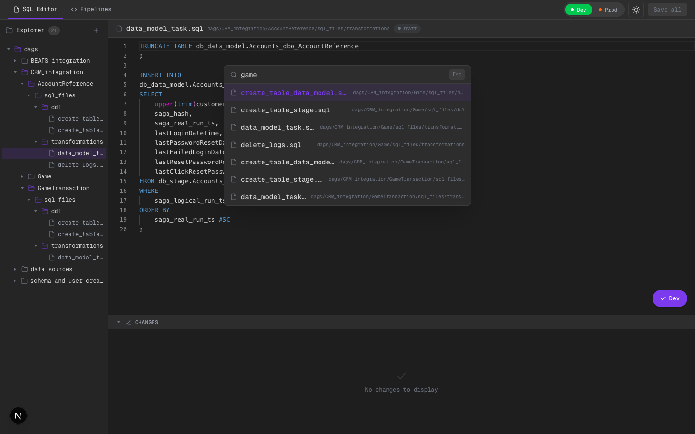
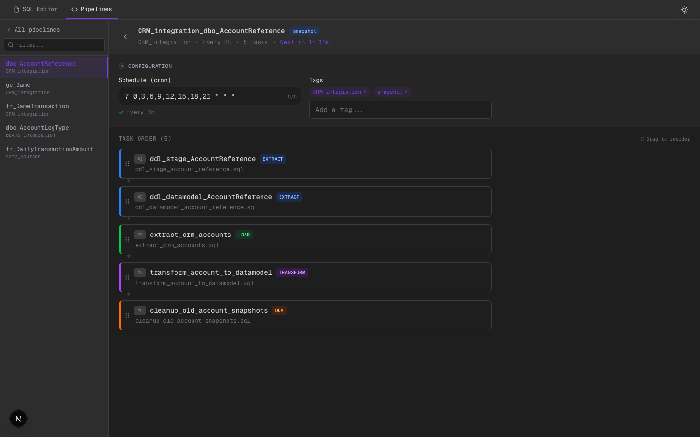

# SQL Pipeline Editor - UI Scaffold

Next.js mock interface that replicates the core workflows of an Airflow-based SQL pipeline system: file browsing, SQL editing, diff review, submit/approval flows, and pipeline task ordering.

**Stack:** Next.js 16 + TypeScript + Monaco Editor + Zustand + Tailwind CSS v4
**Data:** All mock, persisted in localStorage. No backend required.

---

## SQL Editor

Full SQL editing environment with file tree, Monaco editor, and diff viewer.

**Dark mode** — file tree expanded, SQL syntax highlighting, status badges, environment toggle (Dev/Prod):


**Light mode** — same layout, full theme support including Monaco editor theme swap:


### Key features
- Repo browser sidebar with 21 SQL files organized by integration/table
- File count badge, modified indicators (orange dot), status badges (Draft/Submitted/Pending/Approved)
- Create new `.sql` files via `+` button
- Monaco Editor with full SQL syntax highlighting
- ARIA tree roles and keyboard navigation (Tab, Space/Enter)

---

## Diff Panel

Side-by-side diff comparing current buffer vs last saved version. Collapsible via the CHANGES header chevron.


The diff panel shows inline additions (green) and the original content, just like a git diff. The orange dot on the file name and the "Save all (1)" button in the top bar indicate unsaved changes.

---

## Submit & Approval Flow

Environment toggle (Dev/Prod) controls the submit behavior:
- **Dev submit:** status changes to Submitted
- **Prod submit:** status changes to Pending Approval, showing the approval panel



The approval panel shows submission timestamp and Approve/Reject buttons. Toast notifications confirm each action. Note the "Pending" badge in both the file tab and the tree node.

---

## Quick File Search (Cmd+P)

VS Code-style modal with fuzzy filtering across all 21 SQL files. Arrow keys to navigate, Enter to open, Esc to close.



---

## Keyboard Shortcuts (Cmd+?)

Overlay listing all available shortcuts. Global Cmd+S saves the current file from any view with toast feedback.


---


All DAG configurations grouped by integration, with search/filter, type badges, cron schedule descriptions, and next-run countdowns.

**Dark mode:**


**Light mode:**  
#TODO: los create tables no deberian estar en el overview, lo manejamos por atras nosotros
#TODO: si necesitan un ddl ad hoc para campos distintos al default si pueden crearlo 


---

## Pipeline Detail

Per-pipeline view with configuration editor and drag-and-drop task ordering.



### Configuration
- **Cron input:** live validation indicator, 5/5 part counter, preset buttons (Hourly, Every 3h, Daily 6am, Every 15m)
- **Tag editor:** autocomplete from existing tags, chip display with remove, keyboard navigation
- **Next-run countdown** in accent color (e.g., "Next in 1h 14m")

### Task Ordering
- Drag-and-drop reorderable task list (5 tasks per pipeline)
- Task cards with order badge (#1-#5), stage badge (EXTRACT/TRANSFORM/LOAD/DQA), SQL filename
- Color-coded left borders per stage type
- Connector arrows between tasks
- Order persisted to localStorage

---

## Bonus Features

| Feature | Access | Description |
|---------|--------|-------------|
| Quick File Search | `Cmd+P` | Fuzzy-filter and jump to any SQL file |
| Keyboard Shortcuts | `Cmd+?` | Overlay listing all shortcuts |
| Global Save | `Cmd+S` | Saves current file with toast feedback |
| Toast Notifications | Automatic | Slide-in toasts (3s auto-dismiss) on save/submit/approve/reject |
| Next-Run Countdown | Pipelines | Cron parser shows relative time until next execution |
| Collapsible Diff | Click header | Toggle CHANGES panel visibility |
| Dark / Light Mode | Top bar icon | Full theme support including Monaco Editor |
| Keyboard Accessibility | Tab navigation | Focus-visible rings, ARIA roles on all interactive elements |

---

## Architecture

```
ui/src/
├── app/
│   ├── layout.tsx              # Root + global overlays
│   ├── editor/page.tsx         # SQL Editor page
│   └── pipelines/page.tsx      # Pipeline orchestration page
├── lib/
│   ├── store.ts                # Editor store (Zustand + persist)
│   ├── pipeline-store.ts       # Pipeline store (Zustand + persist)
│   ├── toast-store.ts          # Toast notification store
│   ├── types.ts                # Shared TypeScript types
│   ├── mock-data.ts            # 21 SQL files
│   ├── pipeline-mock-data.ts   # 25 tasks across 5 DAGs
│   ├── cron-utils.ts           # Cron parser + next-run calculator
│   └── file-utils.ts           # Flat paths -> tree builder
├── components/
│   ├── Sidebar / FileTree / FileTreeNode
│   ├── EditorPanel / SqlEditor / SqlDiffViewer
│   ├── EditorActionButtons / ApprovalPanel / StatusBadge
│   ├── EnvironmentToggle / ToastContainer
│   ├── QuickOpen / KeyboardShortcuts
│   └── pipeline/
│       ├── PipelineBoard / PipelineOverview / PipelineDetail
│       ├── PipelineNav / PipelineTaskCard
│       └── CronInput / TagEditor
```

## Running

```bash
cd ui && npm install && npm run dev
# http://localhost:3000
```


1. Terminar poasajes a dev y prod con feature branches y confirmacion (estas seguro? ) 
Esto  tiene que ser mediante git si o si, es decir, por un lado tenemos este repo que es el scaffold de ui, pero esto abstrae git de OTRO(varios otros en reallidad), entonces las branches de las que habla son del otro repo. 
actualmente el save solo hace save, y el de send to dev o prod no hace nada creo. La idea es que cada proyecto o lo que sea que sea la session que este laburandod, tenga un branch de un feature branch, que parta de main (o la que sea la base, configurablle) y que pueda comitear (no solo save, peor abbstrayebndo el commmit, es para gente que no sabe git), el send to dev es basicamente mandar el feature branch a dev (mediante un pr y autoaprobarllo?) y hacerlo a prod tb crea el PR pero queda pendiuente de aprobacion. LLa implememntaion actual tiene revision por file, que no tiene sentido en este contexto. Creo que se entiende lo que digo. Tb cuando haga el comit o el PR que deje un mensaje de que esta haciendo, si es fix,feature, etc. 
Pensa como vas as implementar esto, para testear vamos a necesitar tener un repo de prueba en una carpeta externa, y que el scaffold se conecte a ese repo para hacer los commits y los PRs, probablemente subirlo a biucket, por ahora olvidate de los PRs y hace qeu a dev sean merge directo y que a prod sea merge directo tambien pero deja un #TODO o lo que sea que permita que despues podamos implementar esto sin problema, idealmenteae a prod seria con aprobacion de lider poer no se si podemos hacerlo sin tener que hacer PRs (y menos como un hack para mostrar ) pero si se puede gneial. 


2. configurar cada tipo de sql segun folder (extract trasnfgorm load y dqa)

3. parametros completoas dag en editor? no estan todos los del yaml

4. estan muy separados pipe y editor ., por ahi en el pipelines poder hacer click en la task y mostrar editoro de sql 

5. de la misma forma, si estas en la root folder de pieplijne que salga menu de pipe como en el 4 pero al revces, y si estas en un file child tb . o por lo menos tener una tab que salga del costado

6. boton de support con modal de contacto y que nos crea un ticket de jira (sin abrir jira y se manda a #help-data en MM). Por ahora SOLO que permita crear el submit pero que sea dummy y que diga que se creo X ticket de Jira y que se mando el mensaje a #help-data en Mattermost (link al thread por ahi? obviamente dummy)

7. tener login de usuario y de lider que puede aproabr los PRs , por ahora dummy, solo 2 usuarios user y lidear y que el lider pueda aprobar los cambios pedidos por el user en el punto 1 (que por ahora ahora no tener PRs no se como se implementa con solo git local) si no se puede esperamos a los PRs 

8. interfaz avanzada y simple , pensando bien el los puntos 4 y 5 medio que nos dimos cuenta que  estaan separados pero serian dos vistas de lo mismo, el editor de codigo es un nivel mas arriba de un IDE ocmo vs code, podes solo tocar ell SQL y los yaml de ocnfig y las brnaches son invisibles pero tenes codigo. El de pipelines ves directo el pipe, el orden de las tasks, las configuraciones y las tags, pero podes hacer click en la task y te abre ahi un slide para editar sql.... como que son dos interfaces diferentes pero de lo mismo, la idea es salvar los gaps y tal ves que sean 2 modos de lo mismo pero que puedas hacer lo mismo en una u otra (si hay allgo que te suena que si o si no deberia ser para ambos, como orden de tasks poenel, veamos justamente ) esta es la mas dificil del todas 